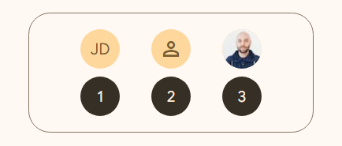
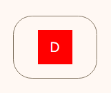

<!-- catalog-only-start --><!-- ---
name: Avatar
dirname: Avatar
-----><!-- catalog-only-end -->

<catalog-component-header>
<catalog-component-header-title slot="title">

# Avatar

<!-- no-catalog-start -->

<!--*
# Document freshness: For more information, see go/fresh-source.
freshness: { owner: 'maicol07' reviewed: '2025-04-21' }
tag: 'docType:reference'
*-->

<!-- go/md-button -->

<!-- [TOC] -->

<!-- external-only-start -->
**This documentation is fully rendered on the
[Material Web Additions catalog](https://material-web-additions.maicol07.it/components/avatar/).**
<!-- external-only-end -->

<!-- no-catalog-end -->

Avatar is a visual representation of a user or an object. It can be used to represent a person, an object, or a group of people.

</catalog-component-header-title>


</catalog-component-header>

* [API Documentation](#api)
* [Source code](https://github.com/maicol07/material-web-additions/tree/main/avatar)
  <!-- {.external} -->

<!-- catalog-only-start -->

<!--

## Interactive Demo



-->

<!-- catalog-only-end -->

## Types

<!-- no-catalog-start -->



<!-- no-catalog-end -->
<!-- catalog-only-start -->

<!--

<div class="figure-wrapper">
  <figure
      class="types-image"
      style="justify-content:center;"
      title="Different avatar types"
      aria-label="The 3 types of cards">
    <style>
      .types-image .wrapper,
      .types-image .wrapper > * {
        display: flex;
        padding: 8px;
        flex-wrap: wrap;
        justify-content: center;
      }
      .types-image .wrapper > * {
        flex-direction: column;
        align-items: center;
        padding-inline: 16px;
      }
      .types-image span {
        display: inline-flex;
        background-color: var(--md-sys-color-inverse-surface);
        color: var(--md-sys-color-inverse-on-surface);
        padding: 8px;
        margin-block-start: 8px;
        width: 24px;
        height: 24px;
        border-radius: 50%;
        justify-content: center;
        align-items: center;
      }
    </style>
    <div class="wrapper">
      <div>
        <md-avatar>John Doe</md-avatar>
        <span>1</span>
      </div>
      <div>
        <md-avatar>
            <md-icon>person</md-icon>
        </md-avatar>
        <span>2</span>
      </div>
      <div>
        <md-avatar>
            
        </md-avatar>
        <span>3</span>
      </div>
    </div>
  </figure>
</div>

-->

<!-- catalog-only-end -->

1. [Text avatar](#text-avatar)
2. [Icon avatar](#icon-avatar)
3. [Image avatar](#image-avatar)

## Usage
Avatar can be used to represent a person, an object, or a group of people.

```html
<md-avatar>
  John Doe
</md-avatar>
```

### Text avatar
An avatar can contain text.
The text initials (up to two) will be displayed in the center of the avatar

```html
<md-avatar>
    John Doe
</md-avatar>

<!-- or -->
<md-avatar>
    <span>John Doe</span>
</md-avatar>
```

### Icon avatar
An avatar can contain an icon instead of text.

```html
<md-avatar>
    <md-icon>person</md-icon>
</md-avatar>
```

### Image avatar
An avatar can contain an image instead of text or an icon.

```html
<md-avatar>
  
</md-avatar>
```

## Theming

Avatars supports [Material theming](https://material-web.dev/theming/material-theming/) and can be customized
in terms of color, typography, and shape.

### Tokens
| Token                         | Default value                       |
|-------------------------------|-------------------------------------|
| `--md-avatar-container-color` | `--md-sys-color-secondary-color`    |
| `--md-avatar-text-color`      | `--md-sys-color-on-secondary-color` |
| `--md-avatar-size`            | `40px`                              |
| `--md-avatar-shape`           | `--md-sys-shape-corner-full`        |

* [All tokens](https://github.com/maicol07/material-web-additions/blob/main/tokens/_md-comp-avatar.scss)
  <!-- {.external} -->

### Example

<!-- no-catalog-start -->



<!-- no-catalog-end -->
<!-- catalog-only-start -->

<!--

<div class="figure-wrapper">
  <figure
      style="justify-content:center;align-items:center;"
      class="styled-example"
      title="Avatar theming example."
      aria-label="Image of an avatar with a different theme applied">
    <style>
      .styled-example {
        --md-avatar-shape: 0px;
        --md-avatar-container-color: red;
        --md-avatar-text-color: white;
      }
    </style>

    <md-avatar>
      John Doe
    </md-avatar>
  </figure>
</div>

-->

<!-- catalog-only-end -->

```html
<style>
  .styled-example {
    --md-avatar-shape: 0px;
    --md-avatar-container-color: red;
    --md-avatar-text-color: white;
  }
</style>

<md-avatar>
  John Doe
</md-avatar>
```

<!-- auto-generated API docs start -->
<!-- auto-generated API docs end -->
