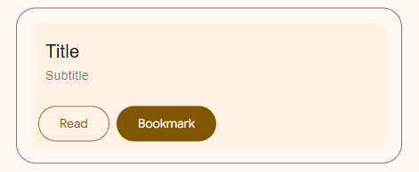
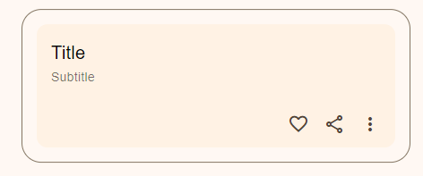
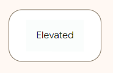
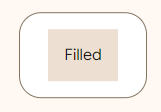
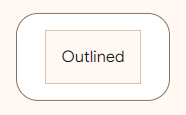

<!-- catalog-only-start --><!-- ---
name: Card
dirname: card
-----><!-- catalog-only-end -->

<catalog-component-header>
<catalog-component-header-title slot="title">

# Card

<!-- no-catalog-start -->

<!--*
# Document freshness: For more information, see go/fresh-source.
freshness: { owner: 'maicol07' reviewed: '2023-09-28' }
tag: 'docType:reference'
*-->

<!-- go/md-button -->

<!-- [TOC] -->

<!-- external-only-start -->
**This documentation is fully rendered on the
[Material Web Additions catalog](https://material-web-additions.maicol07.it/components/card/).**
<!-- external-only-end -->

<!-- no-catalog-end -->

[Cards](https://m3.material.io/components/cards) display content and actions about a single subject.
MD Card encapsulates [MDC Card](https://material.io/components/cards/web#using-cards).

</catalog-component-header-title>


</catalog-component-header>

* [Design article](https://m3.material.io/components/cards) <!-- {.external} -->
* [API Documentation](#api)
* [Source code](https://github.com/maicol07/material-web-additions/tree/main/card)
  <!-- {.external} -->

> [!WARNING]
> The Card component is deprecated and will be removed in the next major version since it's added in @material/web as experimental component.

<!-- catalog-only-start -->

<!--

## Interactive Demo



-->

<!-- catalog-only-end -->

## Types

<!-- no-catalog-start -->


<!-- no-catalog-end -->
<!-- catalog-only-start -->

<!--

<div class="figure-wrapper">
  <figure
      class="types-image"
      style="justify-content:center;"
      title="Elevated, filled and outlined cards"
      aria-label="The 3 types of cards">
    <style>
      .types-image .wrapper,
      .types-image .wrapper > * {
        display: flex;
        padding: 8px;
        flex-wrap: wrap;
        justify-content: center;
      }
      .types-image .wrapper > * {
        flex-direction: column;
        align-items: center;
        padding-inline: 16px;
      }
      .types-image span {
        display: inline-flex;
        background-color: var(--md-sys-color-inverse-surface);
        color: var(--md-sys-color-inverse-on-surface);
        padding: 8px;
        margin-block-start: 8px;
        width: 24px;
        height: 24px;
        border-radius: 50%;
        justify-content: center;
        align-items: center;
      }
    </style>
    <div class="wrapper">
      <div>
        <md-elevated-card style="width: 200px; height: 150px; --md-card-padding: 16px;">
          Elevated
        </md-elevated-card>
        <span>1</span>
      </div>
      <div>
        <md-filled-card style="width: 200px; height: 150px; --md-card-padding: 16px;">
          Filled
        </md-filled-card>
        <span>2</span>
      </div>
      <div>
        <md-outlined-card style="width: 200px; height: 150px; --md-card-padding: 16px;">
          Outlined
        </md-outlined-card>
        <span>3</span>
      </div>
    </div>
  </figure>
</div>

-->

<!-- catalog-only-end -->

1. [Elevated card](#elevated-card)
2. [Filled card](#filled-card)
3. [Outlined card](#outlined-card)

## Usage
Cards can contain any type of content, including text, images, and actions.

<!-- no-catalog-start -->


<!-- no-catalog-end -->
<!-- catalog-only-start -->

<!--

<div class="figure-wrapper">
  <figure
      style="justify-content:center;gap: 8px;padding: 16px;"
      title="Outlined and filled cards."
      aria-label="An outlined card with the text 'Content' next to a filled card with the text 'Content'">
            <md-filled-card style="--md-card-padding: 16px;">
                Content
            </md-filled-card>
            <md-outlined-card style="--md-card-padding: 16px;">
                Content
            </md-outlined-card>
  </figure>
</div>

-->

<!-- catalog-only-end -->

```html
<md-filled-card style="--md-card-padding: 16px;">
  Content
</md-filled-card>
<md-outlined-card style="--md-card-padding: 16px;">
  Content
</md-outlined-card>
```

> Note: You may want to apply padding to card contents (recommended to `16px` by the Material Design guidelines).
> In the previous live example and the following one the padding is already applied.
> ```css
> md-elevated-card {
> --md-card-padding: 16px;
> }
> ```

### Primary action
A card can be clicked to trigger an action.

<!-- no-catalog-start -->

[//]: # (![A clickable elevated card with the title 'Our Changing Planet' and the subtitle 'by Kurt Wagner']&#40;images/card/usage-primary-action.png "Slot in icons to the appropriate slots"&#41;)

<!-- no-catalog-end -->
<!-- catalog-only-start -->

<!--

<div class="figure-wrapper">
  <figure
      style="justify-content:center;gap: 8px;padding: 16px;"
      title="Outlined and filled cards."
      aria-label="A clickable elevated card with the title 'Our Changing Planet' and the subtitle 'by Kurt Wagner'">
    <md-elevated-card clickable class="demo-card">
      <div class="demo-card__header">
        <div class="demo-card__header-text">
          <div class="demo-card__title">Our Changing Planet</div>
          <div class="demo-card__subtitle">by Kurt Wagner</div>
        </div>
      </div>
    </md-elevated-card>
  </figure>
</div>

-->

<!-- catalog-only-end -->

```html
<md-elevated-card clickable class="demo-card">
  <div class="demo-card__header">
    <div class="demo-card__header-text">
      <div class="demo-card__title">Our Changing Planet</div>
      <div class="demo-card__subtitle">by Kurt Wagner</div>
    </div>
  </div>
</md-elevated-card>
```

### Media
A card can display a media element, such as a photo, in a consistent way.

<!-- no-catalog-start -->


<!-- no-catalog-end -->
<!-- catalog-only-start -->

<!--

<div class="figure-wrapper">
  <figure
      style="justify-content:center;gap: 8px;padding: 16px;"
      title="Outlined and filled cards."
      aria-label="A clickable elevated card with the title 'Our Changing Planet', the subtitle 'by Kurt Wagner', a description and a placeholder image">

<style>
.demo-card {
  width: 400px;

  img:not(:first-child) {
    padding-bottom: 16px;
  }
}

.demo-card--with-custom-borders {
  --md-card-container-shape: 24px 8px;
}

.demo-card__header {
  display: flex;
  flex-direction: row;
  padding: 16px;
}

.demo-card-thumbnail {
  width: 40px;
  height: 40px;
  line-height: 2.25;
  background-color: #d9d9d9;
  border-radius: 50%;
  margin: 0 16px 0 0;
  align-self: center;
}

.demo-card__header-text {
  display: flex;
  flex-direction: column;
}

.demo-card__title,
.demo-card__subtitle,
.demo-card__secondary {
  font-family: Roboto, sans-serif;
}

.demo-card__title {
  font-size: 1.25rem !important;
  font-weight: 500;
  line-height: 2rem;
  letter-spacing: .0125em;
  color: rgba(0, 0, 0);
}

.demo-card__subtitle {
  font-size: .875rem !important;
  line-height: 1.375rem;
  font-weight: 500;
  letter-spacing: .0178571429em;
  color: rgba(0, 0, 0, 0.54);
  text-decoration: inherit;
  text-decoration-line: inherit;
  text-decoration-style: inherit;
  text-decoration-color: inherit;
}

.demo-card__secondary {
  font-size: .875rem !important;
  line-height: 1.25rem;
  font-weight: 400;
  letter-spacing: .0178571429em;
  color:
          rgba(0, 0, 0, 0.54);
  text-decoration: inherit;
  text-transform: inherit;
  /* top margin adjusted for 16px of line-height, length to baseline 28px*/
  /* bottom margin adjusted for 2px of line-height, length to baseline */
  /* padding: 12px 16px 22px; */
  padding: 0 1rem 8px;
}

.demo-card--with-text-over-media .demo-card__secondary,
.demo-card--with-header .demo-card__secondary {
  padding-top: 1rem;
}

.demo-card--with-media-header .demo-card__header {
  padding: 0;
  border-top-left-radius: inherit;
  border-top-right-radius: inherit;
}

.demo-card--with-media-header .demo-card__media {
  width: 110px;
  border-top-left-radius: inherit;
  border-top-right-radius: inherit;
  --mdc-card-media-border-top-left-radius: 10px;
  --mdc-card-media-border-top-right-radius: 10px;
}

.demo-card--with-media-header .demo-card__header-text {
  padding: 1rem;
}

.demo-card__media {
  --mdc-card-media-background-image: url("https://material-components.github.io/material-components-web-catalog/static/media/photos/3x2/2.jpg");
}

.demo-card__media-content .demo-card__title,
.demo-card__media-content .demo-card__subtitle {
  color: rgb(255, 255, 255);
}

.demo-card__media-content {
  display: flex;
  align-items: flex-end;
  width: 100%;
  height: 100%;
}

.demo-crop-image {
  background-size: 200%;
}
</style>    
<md-elevated-card class="demo-card" clickable>
          
          <div class="demo-card__header">
              <div class="demo-card__header-text">
                  <div class="demo-card__title">Our Changing Planet</div>
                  <div class="demo-card__subtitle">by Kurt Wagner</div>
              </div>
          </div>
          <div class="demo-card__secondary mdc-typography mdc-typography--body2">
              Visit ten places on our planet that are undergoing the biggest changes today.
          </div>
      </md-elevated-card>
  </figure>
</div>

-->

<!-- catalog-only-end -->

```html
<md-elevated-card class="demo-card" clickable>
  
  <div class="demo-card__header">
    <div class="demo-card__header-text">
      <div class="demo-card__title">Our Changing Planet</div>
      <div class="demo-card__subtitle">by Kurt Wagner</div>
    </div>
  </div>
  <div class="demo-card__secondary mdc-typography mdc-typography--body2">
    Visit ten places on our planet that are undergoing the biggest changes today.
  </div>
</md-elevated-card>
```

### Actions
A card can display explicit actions for users to take.

#### Buttons
A card can contain buttons.

<!-- no-catalog-start -->



<!-- no-catalog-end -->
<!-- catalog-only-start -->

<!--

<div class="figure-wrapper">
  <figure
      style="justify-content:center;gap: 8px;padding: 16px;"
      title="Card with buttons"
      aria-label="A clickable elevated card with a text and a subtitle and two buttons"> 
      <md-elevated-card class="demo-card" clickable>
          <div class="demo-card__header">
              <div class="demo-card__header-text">
                  <div class="demo-card__title">Title</div>
                  <div class="demo-card__subtitle">Subtitle</div>
              </div>
          </div>
          <md-outlined-button slot="button">Read</md-outlined-button>
          <md-filled-button slot="button">Bookmark</md-filled-button>
      </md-elevated-card>
  </figure>
</div>

-->

<!-- catalog-only-end -->

```html
<md-elevated-card class="demo-card" clickable>
    <div class="demo-card__header">
        <div class="demo-card__header-text">
            <div class="demo-card__title">Title</div>
            <div class="demo-card__subtitle">Subtitle</div>
        </div>
    </div>
    <md-outlined-button slot="button">Read</md-outlined-button>
    <md-filled-button slot="button">Bookmark</md-filled-button>
</md-elevated-card>
```
#### Icon Buttons
A card can contain buttons.

<!-- no-catalog-start -->



<!-- no-catalog-end -->
<!-- catalog-only-start -->

<!--

<div class="figure-wrapper">
  <figure
      style="justify-content:center;gap: 8px;padding: 16px;"
      title="Card with icon buttons"
      aria-label="A clickable elevated card with a and a subtitle and three icon buttons"> 
      <md-elevated-card class="demo-card" clickable>
          <div class="demo-card__header">
              <div class="demo-card__header-text">
                  <div class="demo-card__title">Title</div>
                  <div class="demo-card__subtitle">Subtitle</div>
              </div>
          </div>
          <md-icon-button slot="icon">
              <md-icon>favorite</md-icon>
          </md-icon-button>
          <md-icon-button slot="icon">
              <md-icon>share</md-icon>
          </md-icon-button>
          <md-icon-button slot="icon">
              <md-icon>more_vert</md-icon>
          </md-icon-button>
      </md-elevated-card>
  </figure>
</div>

-->

<!-- catalog-only-end -->

```html
<md-elevated-card class="demo-card" clickable>
  <div class="demo-card__header">
    <div class="demo-card__header-text">
      <div class="demo-card__title">Title</div>
      <div class="demo-card__subtitle">Subtitle</div>
    </div>
  </div>
  <md-icon-button slot="icon">
    <md-icon>favorite</md-icon>
  </md-icon-button>
  <md-icon-button slot="icon">
    <md-icon>share</md-icon>
  </md-icon-button>
  <md-icon-button slot="icon">
    <md-icon>more_vert</md-icon>
  </md-icon-button>
</md-elevated-card>
```

## Theming

Cards supports [Material theming](https://material-web.dev/theming/material-theming/) and can be customized
in terms of color, typography, and shape.

### Elevated card tokens
| Token                                | Default value                          |
|--------------------------------------|----------------------------------------|
| `--md-card-padding`                  | `16px`                                 |
| `--md-card-margin`                   | `16px`                                 |
| `--md-elevated-card-container-color` | `--md-sys-color-surface-container-low` |
| `--md-elevated-card-container-shape` | `--md-sys-shape-corner-medium`         |

* [All tokens](https://github.com/maicol07/material-web-additions/blob/main/tokens/_md-comp-elevated-card.scss)
  <!-- {.external} -->

### Elevated card example

<!-- no-catalog-start -->



<!-- no-catalog-end -->
<!-- catalog-only-start -->

<!--

<div class="figure-wrapper">
  <figure
      style="justify-content:center;align-items:center;"
      class="styled-example"
      title="Elevated button theming example."
      aria-label="Image of an elevated button with a different theme applied">
    <style>
      .styled-example {
        background-color: white;
        --md-elevated-card-container-shape: 0px;
        --md-sys-color-surface-container-low: #FAFDFC;
        --md-sys-color-primary: #191C1C;
        --md-card-padding: 16px;
      }
    </style>

    <md-elevated-card>Elevated</md-elevated-card>
  </figure>
</div>

-->

<!-- catalog-only-end -->

```html
<style>
  .styled-example {
    background-color: white;
    --md-elevated-card-container-shape: 0px;
    --md-sys-color-surface-container-low: #FAFDFC;
    --md-sys-color-primary: #191C1C;
    --md-card-padding: 16px;
  }
</style>

<md-elevated-card>Elevated</md-elevated-card>
```

### Filled card tokens
| Token                              | Default value                              |
|------------------------------------|--------------------------------------------|
| `--md-card-padding`                | `16px`                                     |
| `--md-card-margin`                 | `16px`                                     |
| `--md-filled-card-container-color` | `--md-sys-color-surface-container-highest` |
| `--md-filled-card-container-shape` | `--md-sys-shape-corner-medium`             |

* [All tokens](https://github.com/maicol07/material-web-additions/blob/main/tokens/_md-comp-filled-card.scss)
  <!-- {.external} -->

### Filled card example

<!-- no-catalog-start -->



<!-- no-catalog-end -->
<!-- catalog-only-start -->

<!--

<div class="figure-wrapper">
  <figure
      style="justify-content:center;align-items:center;"
      class="styled-example"
      title="Elevated button theming example."
      aria-label="Image of an elevated button with a different theme applied">
    <style>
      .styled-example {
        background-color: white;
        --md-filled-card-container-shape: 0px;
        --md-sys-color-surface-container-low: #FAFDFC;
        --md-sys-color-primary: #191C1C;
        --md-card-padding: 16px;
      }
    </style>

    <md-filled-card>Filled</md-filled-card>
  </figure>
</div>

-->

<!-- catalog-only-end -->

```html
<style>
  .styled-example {
    background-color: white;
    --md-filled-card-container-shape: 0px;
    --md-sys-color-surface-container-low: #FAFDFC;
    --md-sys-color-primary: #191C1C;
    --md-card-padding: 16px;
  }
</style>

<md-filled-card>Filled</md-filled-card>
```

### Outlined card tokens
| Token                                | Default value                  |
|--------------------------------------|--------------------------------|
| `--md-card-padding`                  | `16px`                         |
| `--md-card-margin`                   | `16px`                         |
| `--md-outlined-card-container-color` | `--md-sys-color-surface`       |
| `--md-outlined-card-container-shape` | `--md-sys-shape-corner-medium` |

* [All tokens](https://github.com/maicol07/material-web-additions/blob/main/tokens/_md-comp-outlined-card.scss)
  <!-- {.external} -->

### Outlined card example

<!-- no-catalog-start -->



<!-- no-catalog-end -->
<!-- catalog-only-start -->

<!--

<div class="figure-wrapper">
  <figure
      style="justify-content:center;align-items:center;"
      class="styled-example"
      title="Outlined card theming example."
      aria-label="Image of an outlined card with a different theme applied">
    <style>
      .styled-example {
        background-color: white;
        --md-outlined-card-container-shape: 0px;
        --md-sys-color-surface-container-low: #FAFDFC;
        --md-sys-color-primary: #191C1C;
        --md-card-padding: 16px;
      }
    </style>

    <md-outlined-card>Outlined</md-outlined-card>
  </figure>
</div>

-->

<!-- catalog-only-end -->

```html
<style>
  .styled-example {
    background-color: white;
    --md-outlined-card-container-shape: 0px;
    --md-sys-color-surface-container-low: #FAFDFC;
    --md-sys-color-primary: #191C1C;
    --md-card-padding: 16px;
  }
</style>

<md-outlined-card>Outlined</md-outlined-card>
```


<!-- auto-generated API docs start -->

## API


### MdElevatedCard <code>&lt;md-elevated-card&gt;</code>

#### Properties

<!-- mdformat off(autogenerated might break rendering in catalog) -->

Property | Attribute | Type | Default | Description
--- | --- | --- | --- | ---
`clickable` | `clickable` | `boolean` | `false` | Allows the card to be clickable with a ripple effect.

<!-- mdformat on(autogenerated might break rendering in catalog) -->

### MdFilledCard <code>&lt;md-filled-card&gt;</code>

#### Properties

<!-- mdformat off(autogenerated might break rendering in catalog) -->

Property | Attribute | Type | Default | Description
--- | --- | --- | --- | ---
`clickable` | `clickable` | `boolean` | `false` | Allows the card to be clickable with a ripple effect.

<!-- mdformat on(autogenerated might break rendering in catalog) -->

### MdOutlinedCard <code>&lt;md-outlined-card&gt;</code>

#### Properties

<!-- mdformat off(autogenerated might break rendering in catalog) -->

Property | Attribute | Type | Default | Description
--- | --- | --- | --- | ---
`clickable` | `clickable` | `boolean` | `false` | Allows the card to be clickable with a ripple effect.

<!-- mdformat on(autogenerated might break rendering in catalog) -->

<!-- auto-generated API docs end -->
