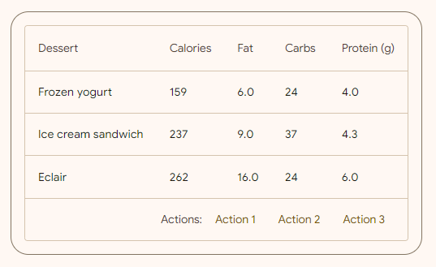
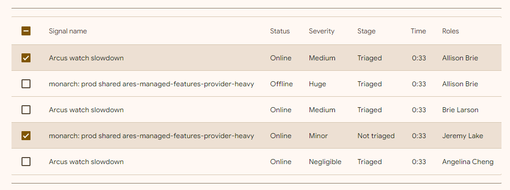
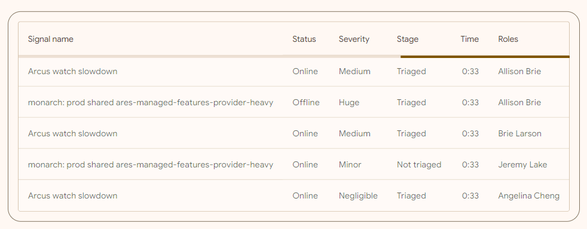
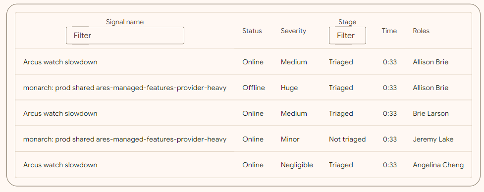
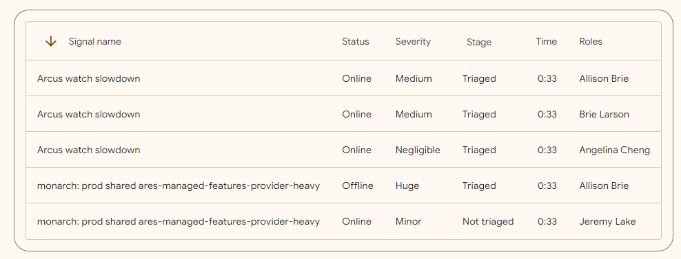
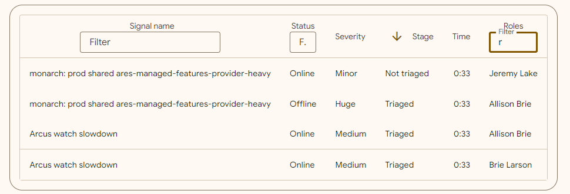

<!-- catalog-only-start --><!-- ---
name: Data Table
dirname: data-table
-----><!-- catalog-only-end -->

<catalog-component-header>
<catalog-component-header-title slot="title">

# Data Table

<!-- no-catalog-start -->

<!--*
# Document freshness: For more information, see go/fresh-source.
freshness: { owner: 'maicol07' reviewed: '2023-10-02' }
tag: 'docType:reference'
*-->

<!-- go/md-button -->

<!-- [TOC] -->

<!-- external-only-start -->
**This documentation is fully rendered on the
[Material Web Additions catalog](https://material-web-additions.maicol07.it/components/data-table/).**
<!-- external-only-end -->

<!-- no-catalog-end -->

[Data tables](https://material.io/components/data-tables/) display sets of data across rows and columns.

They organize information in a way that’s easy to scan, so that users can look for patterns and insights.

Data tables can contain:

- Interactive components (such as chips, buttons, or menus)
- Non-interactive elements (such as badges)
- Tools to query and manipulate data

MD Data table encapsulates [MDC Data Table](https://material.io/components/data-tables).

</catalog-component-header-title>


</catalog-component-header>

* [Design article](https://material.io/components/data-table) <!-- {.external} -->
* [API Documentation](#api)
* [Source code](https://github.com/maicol07/material-web-additions/tree/main/data-table)
  <!-- {.external} -->

<!-- catalog-only-start -->

<!--

## Interactive Demo



-->

<!-- catalog-only-end -->

## Usage

<!-- no-catalog-start -->


<!-- no-catalog-end -->
<!-- catalog-only-start -->

<!--

<div class="figure-wrapper">
  <figure
      style="justify-content:center;gap: 8px;padding: 16px;"
      title="Outlined and filled cards."
      aria-label="An outlined card with the text 'Content' next to a filled card with the text 'Content'">
    <md-data-table aria-label="Desserts" density="" page-sizes="[10, 25, 100]" page-sizes-label="Rows per page:" first-row-of-page="" current-page-size="" last-row-of-page="" pagination-total-label=":firstRow-:lastRow of :totalRows">
      <md-data-table-column>Dessert</md-data-table-column>
      <md-data-table-column>Calories</md-data-table-column>
      <md-data-table-column>Fat</md-data-table-column>
      <md-data-table-column>Carbs</md-data-table-column>
      <md-data-table-column>Protein (g)</md-data-table-column>
      <md-data-table-row>
        <md-data-table-cell>Frozen yogurt</md-data-table-cell>
        <md-data-table-cell type="number">159</md-data-table-cell>
        <md-data-table-cell type="number">6.0</md-data-table-cell>
        <md-data-table-cell type="number">24</md-data-table-cell>
        <md-data-table-cell type="number">4.0</md-data-table-cell>
      </md-data-table-row>
      <md-data-table-row>
        <md-data-table-cell>Ice cream sandwich</md-data-table-cell>
        <md-data-table-cell type="number">237</md-data-table-cell>
        <md-data-table-cell type="number">9.0</md-data-table-cell>
        <md-data-table-cell type="number">37</md-data-table-cell>
        <md-data-table-cell type="number">4.3</md-data-table-cell>
      </md-data-table-row>
      <md-data-table-row>
        <md-data-table-cell>Eclair</md-data-table-cell>
        <md-data-table-cell type="number">262</md-data-table-cell>
        <md-data-table-cell type="number">16.0</md-data-table-cell>
        <md-data-table-cell type="number">24</md-data-table-cell>
        <md-data-table-cell type="number">6.0</md-data-table-cell>
      </md-data-table-row>
    </md-data-table>
  </figure>
</div>

-->

<!-- catalog-only-end -->

```html
<md-data-table aria-label="Desserts" density="" page-sizes="[10, 25, 100]" page-sizes-label="Rows per page:" first-row-of-page="" current-page-size="" last-row-of-page="" pagination-total-label=":firstRow-:lastRow of :totalRows">
  <md-data-table-column>Dessert</md-data-table-column>
  <md-data-table-column>Calories</md-data-table-column>
  <md-data-table-column>Fat</md-data-table-column>
  <md-data-table-column>Carbs</md-data-table-column>
  <md-data-table-column>Protein (g)</md-data-table-column>
  <md-data-table-row>
    <md-data-table-cell>Frozen yogurt</md-data-table-cell>
    <md-data-table-cell type="number">159</md-data-table-cell>
    <md-data-table-cell type="number">6.0</md-data-table-cell>
    <md-data-table-cell type="number">24</md-data-table-cell>
    <md-data-table-cell type="number">4.0</md-data-table-cell>
  </md-data-table-row>
  <md-data-table-row>
    <md-data-table-cell>Ice cream sandwich</md-data-table-cell>
    <md-data-table-cell type="number">237</md-data-table-cell>
    <md-data-table-cell type="number">9.0</md-data-table-cell>
    <md-data-table-cell type="number">37</md-data-table-cell>
    <md-data-table-cell type="number">4.3</md-data-table-cell>
  </md-data-table-row>
  <md-data-table-row>
    <md-data-table-cell>Eclair</md-data-table-cell>
    <md-data-table-cell type="number">262</md-data-table-cell>
    <md-data-table-cell type="number">16.0</md-data-table-cell>
    <md-data-table-cell type="number">24</md-data-table-cell>
    <md-data-table-cell type="number">6.0</md-data-table-cell>
  </md-data-table-row>
</md-data-table>
```

### With footer
The `grid-span` attribute can be used to specify the number of columns a cell should span.

<!-- no-catalog-start -->



<!-- no-catalog-end -->
<!-- catalog-only-start -->

<!--

<div class="figure-wrapper">
  <figure
      style="justify-content:center;gap: 8px;padding: 16px;"
      title="Outlined and filled cards."
      aria-label="A clickable elevated card with the title 'Our Changing Planet' and the subtitle 'by Kurt Wagner'">
    <md-data-table aria-label="Desserts" density="" page-sizes="[10, 25, 100]" page-sizes-label="Rows per page:" first-row-of-page="" current-page-size="" last-row-of-page="" pagination-total-label=":firstRow-:lastRow of :totalRows">
      <md-data-table-column>Dessert</md-data-table-column>
      <md-data-table-column>Calories</md-data-table-column>
      <md-data-table-column>Fat</md-data-table-column>
      <md-data-table-column>Carbs</md-data-table-column>
      <md-data-table-column>Protein (g)</md-data-table-column>
      <md-data-table-row>
        <md-data-table-cell>Frozen yogurt</md-data-table-cell>
        <md-data-table-cell type="number">159</md-data-table-cell>
        <md-data-table-cell type="number">6.0</md-data-table-cell>
        <md-data-table-cell type="number">24</md-data-table-cell>
        <md-data-table-cell type="number">4.0</md-data-table-cell>
      </md-data-table-row>
      <md-data-table-row>
        <md-data-table-cell>Ice cream sandwich</md-data-table-cell>
        <md-data-table-cell type="number">237</md-data-table-cell>
        <md-data-table-cell type="number">9.0</md-data-table-cell>
        <md-data-table-cell type="number">37</md-data-table-cell>
        <md-data-table-cell type="number">4.3</md-data-table-cell>
      </md-data-table-row>
      <md-data-table-row>
        <md-data-table-cell>Eclair</md-data-table-cell>
        <md-data-table-cell type="number">262</md-data-table-cell>
        <md-data-table-cell type="number">16.0</md-data-table-cell>
        <md-data-table-cell type="number">24</md-data-table-cell>
        <md-data-table-cell type="number">6.0</md-data-table-cell>
      </md-data-table-row>
        <md-data-table-footer slot="footer" style="display: flex; align-items: center; justify-content: right; gap: 4px;">
            Actions:
            <md-text-button>Action 1</md-text-button>
            <md-text-button>Action 2</md-text-button>
            <md-text-button>Action 3</md-text-button>
        </md-data-table-footer>
    </md-data-table>
  </figure>
</div>

-->

<!-- catalog-only-end -->

```html
<md-data-table aria-label="Desserts" density="" page-sizes="[10, 25, 100]" page-sizes-label="Rows per page:" first-row-of-page="" current-page-size="" last-row-of-page="" pagination-total-label=":firstRow-:lastRow of :totalRows">
  <md-data-table-column>Dessert</md-data-table-column>
  <md-data-table-column>Calories</md-data-table-column>
  <md-data-table-column>Fat</md-data-table-column>
  <md-data-table-column>Carbs</md-data-table-column>
  <md-data-table-column>Protein (g)</md-data-table-column>
  <md-data-table-row>
    <md-data-table-cell>Frozen yogurt</md-data-table-cell>
    <md-data-table-cell type="number">159</md-data-table-cell>
    <md-data-table-cell type="number">6.0</md-data-table-cell>
    <md-data-table-cell type="number">24</md-data-table-cell>
    <md-data-table-cell type="number">4.0</md-data-table-cell>
  </md-data-table-row>
  <md-data-table-row>
    <md-data-table-cell>Ice cream sandwich</md-data-table-cell>
    <md-data-table-cell type="number">237</md-data-table-cell>
    <md-data-table-cell type="number">9.0</md-data-table-cell>
    <md-data-table-cell type="number">37</md-data-table-cell>
    <md-data-table-cell type="number">4.3</md-data-table-cell>
  </md-data-table-row>
  <md-data-table-row>
    <md-data-table-cell>Eclair</md-data-table-cell>
    <md-data-table-cell type="number">262</md-data-table-cell>
    <md-data-table-cell type="number">16.0</md-data-table-cell>
    <md-data-table-cell type="number">24</md-data-table-cell>
    <md-data-table-cell type="number">6.0</md-data-table-cell>
  </md-data-table-row>
    <md-data-table-footer slot="footer" style="display: flex; align-items: center; justify-content: right; gap: 4px;">
        Actions:
        <md-text-button>Action 1</md-text-button>
        <md-text-button>Action 2</md-text-button>
        <md-text-button>Action 3</md-text-button>
    </md-data-table-footer>
</md-data-table>
```

### Row selection
Data table with row selection. A checkbox cell must be added to all the rows and to the header row.

<!-- no-catalog-start -->



<!-- no-catalog-end -->
<!-- catalog-only-start -->

<!--

<div class="figure-wrapper">
  <figure
      style="justify-content:center;gap: 8px;padding: 16px;"
      title="Outlined and filled cards."
      aria-label="A clickable elevated card with the title 'Our Changing Planet', the subtitle 'by Kurt Wagner', a description and a placeholder image">
    <md-data-table aria-label="Dessert calories" density="" page-sizes="[10, 25, 100]" page-sizes-label="Rows per page:" first-row-of-page="" current-page-size="" last-row-of-page="" pagination-total-label=":firstRow-:lastRow of :totalRows" style="--mdc-data-table-width: 875px">
      <md-data-table-column type="checkbox"></md-data-table-column>
      <md-data-table-column>Signal name</md-data-table-column>
      <md-data-table-column>Status</md-data-table-column>
      <md-data-table-column>Severity</md-data-table-column>
      <md-data-table-column>Stage</md-data-table-column>
      <md-data-table-column>Time</md-data-table-column>
      <md-data-table-column>Roles</md-data-table-column>
      <md-data-table-row>
        <md-data-table-cell type="checkbox"></md-data-table-cell>
        <md-data-table-cell>Arcus watch slowdown</md-data-table-cell>
        <md-data-table-cell>Online</md-data-table-cell>
        <md-data-table-cell>Medium</md-data-table-cell>
        <md-data-table-cell>Triaged</md-data-table-cell>
        <md-data-table-cell type="numeric">0:33</md-data-table-cell>
        <md-data-table-cell>Allison Brie</md-data-table-cell>
      </md-data-table-row>
      <md-data-table-row>
        <md-data-table-cell type="checkbox"></md-data-table-cell>
        <md-data-table-cell>monarch: prod shared ares-managed-features-provider-heavy</md-data-table-cell>
        <md-data-table-cell>Offline</md-data-table-cell>
        <md-data-table-cell>Huge</md-data-table-cell>
        <md-data-table-cell>Triaged</md-data-table-cell>
        <md-data-table-cell type="numeric">0:33</md-data-table-cell>
        <md-data-table-cell>Allison Brie</md-data-table-cell>
      </md-data-table-row>
      <md-data-table-row>
        <md-data-table-cell type="checkbox"></md-data-table-cell>
        <md-data-table-cell>Arcus watch slowdown</md-data-table-cell>
        <md-data-table-cell>Online</md-data-table-cell>
        <md-data-table-cell>Medium</md-data-table-cell>
        <md-data-table-cell>Triaged</md-data-table-cell>
        <md-data-table-cell type="numeric">0:33</md-data-table-cell>
        <md-data-table-cell>Brie Larson</md-data-table-cell>
      </md-data-table-row>
      <md-data-table-row>
        <md-data-table-cell type="checkbox"></md-data-table-cell>
        <md-data-table-cell>monarch: prod shared ares-managed-features-provider-heavy</md-data-table-cell>
        <md-data-table-cell>Online</md-data-table-cell>
        <md-data-table-cell>Minor</md-data-table-cell>
        <md-data-table-cell>Not triaged</md-data-table-cell>
        <md-data-table-cell type="numeric">0:33</md-data-table-cell>
        <md-data-table-cell>Jeremy Lake</md-data-table-cell>
      </md-data-table-row>
      <md-data-table-row>
        <md-data-table-cell type="checkbox"></md-data-table-cell>
        <md-data-table-cell>Arcus watch slowdown</md-data-table-cell>
        <md-data-table-cell>Online</md-data-table-cell>
        <md-data-table-cell>Negligible</md-data-table-cell>
        <md-data-table-cell>Triaged</md-data-table-cell>
        <md-data-table-cell type="numeric">0:33</md-data-table-cell>
        <md-data-table-cell>Angelina Cheng</md-data-table-cell>
      </md-data-table-row>
    </md-data-table>
  </figure>
</div>

-->

<!-- catalog-only-end -->

```html
<md-data-table aria-label="Dessert calories" density="" page-sizes="[10, 25, 100]" page-sizes-label="Rows per page:" first-row-of-page="" current-page-size="" last-row-of-page="" pagination-total-label=":firstRow-:lastRow of :totalRows">
      <md-data-table-column type="checkbox"></md-data-table-column>
      <md-data-table-column>Signal name</md-data-table-column>
      <md-data-table-column>Status</md-data-table-column>
      <md-data-table-column>Severity</md-data-table-column>
      <md-data-table-column>Stage</md-data-table-column>
      <md-data-table-column>Time</md-data-table-column>
      <md-data-table-column>Roles</md-data-table-column>

      <md-data-table-row>
        <md-data-table-cell type="checkbox"></md-data-table-cell>
        <md-data-table-cell>Arcus watch slowdown</md-data-table-cell>
        <md-data-table-cell>Online</md-data-table-cell>
        <md-data-table-cell>Medium</md-data-table-cell>
        <md-data-table-cell>Triaged</md-data-table-cell>
        <md-data-table-cell type="numeric">0:33</md-data-table-cell>
        <md-data-table-cell>Allison Brie</md-data-table-cell>
      </md-data-table-row>
      <md-data-table-row>
        <md-data-table-cell type="checkbox"></md-data-table-cell>
        <md-data-table-cell>monarch: prod shared ares-managed-features-provider-heavy</md-data-table-cell>
        <md-data-table-cell>Offline</md-data-table-cell>
        <md-data-table-cell>Huge</md-data-table-cell>
        <md-data-table-cell>Triaged</md-data-table-cell>
        <md-data-table-cell type="numeric">0:33</md-data-table-cell>
        <md-data-table-cell>Allison Brie</md-data-table-cell>
      </md-data-table-row>
      <md-data-table-row>
        <md-data-table-cell type="checkbox"></md-data-table-cell>
        <md-data-table-cell>Arcus watch slowdown</md-data-table-cell>
        <md-data-table-cell>Online</md-data-table-cell>
        <md-data-table-cell>Medium</md-data-table-cell>
        <md-data-table-cell>Triaged</md-data-table-cell>
        <md-data-table-cell type="numeric">0:33</md-data-table-cell>
        <md-data-table-cell>Brie Larson</md-data-table-cell>
      </md-data-table-row>
      <md-data-table-row>
        <md-data-table-cell type="checkbox"></md-data-table-cell>
        <md-data-table-cell>monarch: prod shared ares-managed-features-provider-heavy</md-data-table-cell>
        <md-data-table-cell>Online</md-data-table-cell>
        <md-data-table-cell>Minor</md-data-table-cell>
        <md-data-table-cell>Not triaged</md-data-table-cell>
        <md-data-table-cell type="numeric">0:33</md-data-table-cell>
        <md-data-table-cell>Jeremy Lake</md-data-table-cell>
      </md-data-table-row>
      <md-data-table-row>
        <md-data-table-cell type="checkbox"></md-data-table-cell>
        <md-data-table-cell>Arcus watch slowdown</md-data-table-cell>
        <md-data-table-cell>Online</md-data-table-cell>
        <md-data-table-cell>Negligible</md-data-table-cell>
        <md-data-table-cell>Triaged</md-data-table-cell>
        <md-data-table-cell type="numeric">0:33</md-data-table-cell>
        <md-data-table-cell>Angelina Cheng</md-data-table-cell>
      </md-data-table-row>
    </md-data-table>
```

### Paginated
Paginated data table. Enabled when the `paginated` attribute is set to `true`.

<!-- no-catalog-start -->


<!-- no-catalog-end -->
<!-- catalog-only-start -->

<!--

<div class="figure-wrapper">
  <figure
      style="justify-content:center;gap: 8px;padding: 16px;"
      title="Card with buttons"
      aria-label="A clickable elevated card with a text and a subtitle and two buttons">
      <md-data-table aria-label="Dessert calories" paginated="" density="" page-sizes="[1, 3, 5]" page-sizes-label="Rows per page:" first-row-of-page="" current-page-size="" last-row-of-page="" pagination-total-label=":firstRow-:lastRow of :totalRows">
      <md-data-table-column>Signal name</md-data-table-column>
      <md-data-table-column>Status</md-data-table-column>
      <md-data-table-column>Severity</md-data-table-column>
      <md-data-table-column>Stage</md-data-table-column>
      <md-data-table-column>Time</md-data-table-column>
      <md-data-table-column>Roles</md-data-table-column>
      <md-data-table-row>
        <md-data-table-cell>Arcus watch slowdown</md-data-table-cell>
        <md-data-table-cell>Online</md-data-table-cell>
        <md-data-table-cell>Medium</md-data-table-cell>
        <md-data-table-cell>Triaged</md-data-table-cell>
        <md-data-table-cell type="numeric">0:33</md-data-table-cell>
        <md-data-table-cell>Allison Brie</md-data-table-cell>
      </md-data-table-row>
      <md-data-table-row>
        <md-data-table-cell>monarch: prod shared ares-managed-features-provider-heavy</md-data-table-cell>
        <md-data-table-cell>Offline</md-data-table-cell>
        <md-data-table-cell>Huge</md-data-table-cell>
        <md-data-table-cell>Triaged</md-data-table-cell>
        <md-data-table-cell type="numeric">0:33</md-data-table-cell>
        <md-data-table-cell>Allison Brie</md-data-table-cell>
      </md-data-table-row>
      <md-data-table-row>
        <md-data-table-cell>Arcus watch slowdown</md-data-table-cell>
        <md-data-table-cell>Online</md-data-table-cell>
        <md-data-table-cell>Medium</md-data-table-cell>
        <md-data-table-cell>Triaged</md-data-table-cell>
        <md-data-table-cell type="numeric">0:33</md-data-table-cell>
        <md-data-table-cell>Brie Larson</md-data-table-cell>
      </md-data-table-row>
      <md-data-table-row>
        <md-data-table-cell>monarch: prod shared ares-managed-features-provider-heavy</md-data-table-cell>
        <md-data-table-cell>Online</md-data-table-cell>
        <md-data-table-cell>Minor</md-data-table-cell>
        <md-data-table-cell>Not triaged</md-data-table-cell>
        <md-data-table-cell type="numeric">0:33</md-data-table-cell>
        <md-data-table-cell>Jeremy Lake</md-data-table-cell>
      </md-data-table-row>
      <md-data-table-row>
        <md-data-table-cell>Arcus watch slowdown</md-data-table-cell>
        <md-data-table-cell>Online</md-data-table-cell>
        <md-data-table-cell>Negligible</md-data-table-cell>
        <md-data-table-cell>Triaged</md-data-table-cell>
        <md-data-table-cell type="numeric">0:33</md-data-table-cell>
        <md-data-table-cell>Angelina Cheng</md-data-table-cell>
      </md-data-table-row>
    </md-data-table>
  </figure>
</div>

-->

<!-- catalog-only-end -->

```html
<md-data-table aria-label="Dessert calories" paginated="" density="" page-sizes="[1, 3, 5]" page-sizes-label="Rows per page:" first-row-of-page="" current-page-size="" last-row-of-page="" pagination-total-label=":firstRow-:lastRow of :totalRows">
  <md-data-table-column>Signal name</md-data-table-column>
  <md-data-table-column>Status</md-data-table-column>
  <md-data-table-column>Severity</md-data-table-column>
  <md-data-table-column>Stage</md-data-table-column>
  <md-data-table-column>Time</md-data-table-column>
  <md-data-table-column>Roles</md-data-table-column>

  <md-data-table-row>
    <md-data-table-cell>Arcus watch slowdown</md-data-table-cell>
    <md-data-table-cell>Online</md-data-table-cell>
    <md-data-table-cell>Medium</md-data-table-cell>
    <md-data-table-cell>Triaged</md-data-table-cell>
    <md-data-table-cell type="numeric">0:33</md-data-table-cell>
    <md-data-table-cell>Allison Brie</md-data-table-cell>
  </md-data-table-row>
  <md-data-table-row>
    <md-data-table-cell>monarch: prod shared ares-managed-features-provider-heavy</md-data-table-cell>
    <md-data-table-cell>Offline</md-data-table-cell>
    <md-data-table-cell>Huge</md-data-table-cell>
    <md-data-table-cell>Triaged</md-data-table-cell>
    <md-data-table-cell type="numeric">0:33</md-data-table-cell>
    <md-data-table-cell>Allison Brie</md-data-table-cell>
  </md-data-table-row>
  <md-data-table-row>
    <md-data-table-cell>Arcus watch slowdown</md-data-table-cell>
    <md-data-table-cell>Online</md-data-table-cell>
    <md-data-table-cell>Medium</md-data-table-cell>
    <md-data-table-cell>Triaged</md-data-table-cell>
    <md-data-table-cell type="numeric">0:33</md-data-table-cell>
    <md-data-table-cell>Brie Larson</md-data-table-cell>
  </md-data-table-row>
  <md-data-table-row>
    <md-data-table-cell>monarch: prod shared ares-managed-features-provider-heavy</md-data-table-cell>
    <md-data-table-cell>Online</md-data-table-cell>
    <md-data-table-cell>Minor</md-data-table-cell>
    <md-data-table-cell>Not triaged</md-data-table-cell>
    <md-data-table-cell type="numeric">0:33</md-data-table-cell>
    <md-data-table-cell>Jeremy Lake</md-data-table-cell>
  </md-data-table-row>
  <md-data-table-row>
    <md-data-table-cell>Arcus watch slowdown</md-data-table-cell>
    <md-data-table-cell>Online</md-data-table-cell>
    <md-data-table-cell>Negligible</md-data-table-cell>
    <md-data-table-cell>Triaged</md-data-table-cell>
    <md-data-table-cell type="numeric">0:33</md-data-table-cell>
    <md-data-table-cell>Angelina Cheng</md-data-table-cell>
  </md-data-table-row>
</md-data-table>
```
#### In progress
Align the cells grid to top, middle or bottom. This requires a max-width on the top-level grid element.

<!-- no-catalog-start -->



<!-- no-catalog-end -->
<!-- catalog-only-start -->

<!--

<div class="figure-wrapper">
  <figure
      style="justify-content:center;gap: 8px;padding: 16px;"
      title="Card with icon buttons"
      aria-label="A clickable elevated card with a and a subtitle and three icon buttons">
      <md-data-table aria-label="Dessert calories" in-progress="" density="" page-sizes="[10, 25, 100]" page-sizes-label="Rows per page:" first-row-of-page="" current-page-size="" last-row-of-page="" pagination-total-label=":firstRow-:lastRow of :totalRows">
      <md-data-table-column>Signal name</md-data-table-column>
      <md-data-table-column>Status</md-data-table-column>
      <md-data-table-column>Severity</md-data-table-column>
      <md-data-table-column>Stage</md-data-table-column>
      <md-data-table-column>Time</md-data-table-column>
      <md-data-table-column>Roles</md-data-table-column>
      <md-data-table-row>
        <md-data-table-cell>Arcus watch slowdown</md-data-table-cell>
        <md-data-table-cell>Online</md-data-table-cell>
        <md-data-table-cell>Medium</md-data-table-cell>
        <md-data-table-cell>Triaged</md-data-table-cell>
        <md-data-table-cell type="numeric">0:33</md-data-table-cell>
        <md-data-table-cell>Allison Brie</md-data-table-cell>
      </md-data-table-row>
      <md-data-table-row>
        <md-data-table-cell>monarch: prod shared ares-managed-features-provider-heavy</md-data-table-cell>
        <md-data-table-cell>Offline</md-data-table-cell>
        <md-data-table-cell>Huge</md-data-table-cell>
        <md-data-table-cell>Triaged</md-data-table-cell>
        <md-data-table-cell type="numeric">0:33</md-data-table-cell>
        <md-data-table-cell>Allison Brie</md-data-table-cell>
      </md-data-table-row>
      <md-data-table-row>
        <md-data-table-cell>Arcus watch slowdown</md-data-table-cell>
        <md-data-table-cell>Online</md-data-table-cell>
        <md-data-table-cell>Medium</md-data-table-cell>
        <md-data-table-cell>Triaged</md-data-table-cell>
        <md-data-table-cell type="numeric">0:33</md-data-table-cell>
        <md-data-table-cell>Brie Larson</md-data-table-cell>
      </md-data-table-row>
      <md-data-table-row>
        <md-data-table-cell>monarch: prod shared ares-managed-features-provider-heavy</md-data-table-cell>
        <md-data-table-cell>Online</md-data-table-cell>
        <md-data-table-cell>Minor</md-data-table-cell>
        <md-data-table-cell>Not triaged</md-data-table-cell>
        <md-data-table-cell type="numeric">0:33</md-data-table-cell>
        <md-data-table-cell>Jeremy Lake</md-data-table-cell>
      </md-data-table-row>
      <md-data-table-row>
        <md-data-table-cell>Arcus watch slowdown</md-data-table-cell>
        <md-data-table-cell>Online</md-data-table-cell>
        <md-data-table-cell>Negligible</md-data-table-cell>
        <md-data-table-cell>Triaged</md-data-table-cell>
        <md-data-table-cell type="numeric">0:33</md-data-table-cell>
        <md-data-table-cell>Angelina Cheng</md-data-table-cell>
      </md-data-table-row>
    </md-data-table>
  </figure>
</div>

-->

<!-- catalog-only-end -->

```html
<md-data-table aria-label="Dessert calories" in-progress="" density="" page-sizes="[10, 25, 100]" page-sizes-label="Rows per page:" first-row-of-page="" current-page-size="" last-row-of-page="" pagination-total-label=":firstRow-:lastRow of :totalRows">
      <md-data-table-column>Signal name</md-data-table-column>
      <md-data-table-column>Status</md-data-table-column>
      <md-data-table-column>Severity</md-data-table-column>
      <md-data-table-column>Stage</md-data-table-column>
      <md-data-table-column>Time</md-data-table-column>
      <md-data-table-column>Roles</md-data-table-column>

      <md-data-table-row>
        <md-data-table-cell>Arcus watch slowdown</md-data-table-cell>
        <md-data-table-cell>Online</md-data-table-cell>
        <md-data-table-cell>Medium</md-data-table-cell>
        <md-data-table-cell>Triaged</md-data-table-cell>
        <md-data-table-cell type="numeric">0:33</md-data-table-cell>
        <md-data-table-cell>Allison Brie</md-data-table-cell>
      </md-data-table-row>
      <md-data-table-row>
        <md-data-table-cell>monarch: prod shared ares-managed-features-provider-heavy</md-data-table-cell>
        <md-data-table-cell>Offline</md-data-table-cell>
        <md-data-table-cell>Huge</md-data-table-cell>
        <md-data-table-cell>Triaged</md-data-table-cell>
        <md-data-table-cell type="numeric">0:33</md-data-table-cell>
        <md-data-table-cell>Allison Brie</md-data-table-cell>
      </md-data-table-row>
      <md-data-table-row>
        <md-data-table-cell>Arcus watch slowdown</md-data-table-cell>
        <md-data-table-cell>Online</md-data-table-cell>
        <md-data-table-cell>Medium</md-data-table-cell>
        <md-data-table-cell>Triaged</md-data-table-cell>
        <md-data-table-cell type="numeric">0:33</md-data-table-cell>
        <md-data-table-cell>Brie Larson</md-data-table-cell>
      </md-data-table-row>
      <md-data-table-row>
        <md-data-table-cell>monarch: prod shared ares-managed-features-provider-heavy</md-data-table-cell>
        <md-data-table-cell>Online</md-data-table-cell>
        <md-data-table-cell>Minor</md-data-table-cell>
        <md-data-table-cell>Not triaged</md-data-table-cell>
        <md-data-table-cell type="numeric">0:33</md-data-table-cell>
        <md-data-table-cell>Jeremy Lake</md-data-table-cell>
      </md-data-table-row>
      <md-data-table-row>
        <md-data-table-cell>Arcus watch slowdown</md-data-table-cell>
        <md-data-table-cell>Online</md-data-table-cell>
        <md-data-table-cell>Negligible</md-data-table-cell>
        <md-data-table-cell>Triaged</md-data-table-cell>
        <md-data-table-cell type="numeric">0:33</md-data-table-cell>
        <md-data-table-cell>Angelina Cheng</md-data-table-cell>
      </md-data-table-row>
    </md-data-table>
```
#### With filter text field
Data table with some filter text field. Enabled when the `filterable` attribute is added to a column. Case sensitiveness can be set using the `filterCaseSensitive` attribute.

<!-- no-catalog-start -->



<!-- no-catalog-end -->
<!-- catalog-only-start -->

<!--

<div class="figure-wrapper">
  <figure
      style="justify-content:center;gap: 8px;padding: 16px;"
      title="Card with icon buttons"
      aria-label="A clickable elevated card with a and a subtitle and three icon buttons">
      <md-data-table aria-label="Dessert calories" density="" page-sizes="[10, 25, 100]" page-sizes-label="Rows per page:" first-row-of-page="" current-page-size="" last-row-of-page="" pagination-total-label=":firstRow-:lastRow of :totalRows">
      <md-data-table-column filterable="">Signal name</md-data-table-column>
      <md-data-table-column>Status</md-data-table-column>
      <md-data-table-column>Severity</md-data-table-column>
      <md-data-table-column filterable="" filtercasesensitive="">Stage</md-data-table-column>
      <md-data-table-column>Time</md-data-table-column>
      <md-data-table-column>Roles</md-data-table-column>
      <md-data-table-row>
        <md-data-table-cell>Arcus watch slowdown</md-data-table-cell>
        <md-data-table-cell>Online</md-data-table-cell>
        <md-data-table-cell>Medium</md-data-table-cell>
        <md-data-table-cell>Triaged</md-data-table-cell>
        <md-data-table-cell type="numeric">0:33</md-data-table-cell>
        <md-data-table-cell>Allison Brie</md-data-table-cell>
      </md-data-table-row>
      <md-data-table-row>
        <md-data-table-cell>monarch: prod shared ares-managed-features-provider-heavy</md-data-table-cell>
        <md-data-table-cell>Offline</md-data-table-cell>
        <md-data-table-cell>Huge</md-data-table-cell>
        <md-data-table-cell>Triaged</md-data-table-cell>
        <md-data-table-cell type="numeric">0:33</md-data-table-cell>
        <md-data-table-cell>Allison Brie</md-data-table-cell>
      </md-data-table-row>
      <md-data-table-row>
        <md-data-table-cell>Arcus watch slowdown</md-data-table-cell>
        <md-data-table-cell>Online</md-data-table-cell>
        <md-data-table-cell>Medium</md-data-table-cell>
        <md-data-table-cell>Triaged</md-data-table-cell>
        <md-data-table-cell type="numeric">0:33</md-data-table-cell>
        <md-data-table-cell>Brie Larson</md-data-table-cell>
      </md-data-table-row>
      <md-data-table-row>
        <md-data-table-cell>monarch: prod shared ares-managed-features-provider-heavy</md-data-table-cell>
        <md-data-table-cell>Online</md-data-table-cell>
        <md-data-table-cell>Minor</md-data-table-cell>
        <md-data-table-cell>Not triaged</md-data-table-cell>
        <md-data-table-cell type="numeric">0:33</md-data-table-cell>
        <md-data-table-cell>Jeremy Lake</md-data-table-cell>
      </md-data-table-row>
      <md-data-table-row>
        <md-data-table-cell>Arcus watch slowdown</md-data-table-cell>
        <md-data-table-cell>Online</md-data-table-cell>
        <md-data-table-cell>Negligible</md-data-table-cell>
        <md-data-table-cell>Triaged</md-data-table-cell>
        <md-data-table-cell type="numeric">0:33</md-data-table-cell>
        <md-data-table-cell>Angelina Cheng</md-data-table-cell>
      </md-data-table-row>
    </md-data-table>
  </figure>
</div>

-->

<!-- catalog-only-end -->

```html
<md-data-table aria-label="Dessert calories" density="" page-sizes="[10, 25, 100]" page-sizes-label="Rows per page:" first-row-of-page="" current-page-size="" last-row-of-page="" pagination-total-label=":firstRow-:lastRow of :totalRows">
      <md-data-table-column filterable="">Signal name</md-data-table-column>
      <md-data-table-column>Status</md-data-table-column>
      <md-data-table-column>Severity</md-data-table-column>
      <md-data-table-column filterable="" filtercasesensitive="">Stage</md-data-table-column>
      <md-data-table-column>Time</md-data-table-column>
      <md-data-table-column>Roles</md-data-table-column>

      <md-data-table-row>
        <md-data-table-cell>Arcus watch slowdown</md-data-table-cell>
        <md-data-table-cell>Online</md-data-table-cell>
        <md-data-table-cell>Medium</md-data-table-cell>
        <md-data-table-cell>Triaged</md-data-table-cell>
        <md-data-table-cell type="numeric">0:33</md-data-table-cell>
        <md-data-table-cell>Allison Brie</md-data-table-cell>
      </md-data-table-row>
      <md-data-table-row>
        <md-data-table-cell>monarch: prod shared ares-managed-features-provider-heavy</md-data-table-cell>
        <md-data-table-cell>Offline</md-data-table-cell>
        <md-data-table-cell>Huge</md-data-table-cell>
        <md-data-table-cell>Triaged</md-data-table-cell>
        <md-data-table-cell type="numeric">0:33</md-data-table-cell>
        <md-data-table-cell>Allison Brie</md-data-table-cell>
      </md-data-table-row>
      <md-data-table-row>
        <md-data-table-cell>Arcus watch slowdown</md-data-table-cell>
        <md-data-table-cell>Online</md-data-table-cell>
        <md-data-table-cell>Medium</md-data-table-cell>
        <md-data-table-cell>Triaged</md-data-table-cell>
        <md-data-table-cell type="numeric">0:33</md-data-table-cell>
        <md-data-table-cell>Brie Larson</md-data-table-cell>
      </md-data-table-row>
      <md-data-table-row>
        <md-data-table-cell>monarch: prod shared ares-managed-features-provider-heavy</md-data-table-cell>
        <md-data-table-cell>Online</md-data-table-cell>
        <md-data-table-cell>Minor</md-data-table-cell>
        <md-data-table-cell>Not triaged</md-data-table-cell>
        <md-data-table-cell type="numeric">0:33</md-data-table-cell>
        <md-data-table-cell>Jeremy Lake</md-data-table-cell>
      </md-data-table-row>
      <md-data-table-row>
        <md-data-table-cell>Arcus watch slowdown</md-data-table-cell>
        <md-data-table-cell>Online</md-data-table-cell>
        <md-data-table-cell>Negligible</md-data-table-cell>
        <md-data-table-cell>Triaged</md-data-table-cell>
        <md-data-table-cell type="numeric">0:33</md-data-table-cell>
        <md-data-table-cell>Angelina Cheng</md-data-table-cell>
      </md-data-table-row>
    </md-data-table>
```
#### With sorting
Data table with some sortable columns. Enabled when the sortable attribute is added to a column. You can control the sort direction via the `sortedDescending` attribute.

<!-- no-catalog-start -->



<!-- no-catalog-end -->
<!-- catalog-only-start -->

<!--

<div class="figure-wrapper">
  <figure
      style="justify-content:center;gap: 8px;padding: 16px;"
      title="Card with icon buttons"
      aria-label="A clickable elevated card with a and a subtitle and three icon buttons">
      <md-data-table aria-label="Dessert calories" density="" page-sizes="[10, 25, 100]" page-sizes-label="Rows per page:" first-row-of-page="" current-page-size="" last-row-of-page="" pagination-total-label=":firstRow-:lastRow of :totalRows">
      <md-data-table-column sortable="" sorted="">Signal name</md-data-table-column>
      <md-data-table-column>Status</md-data-table-column>
      <md-data-table-column>Severity</md-data-table-column>
      <md-data-table-column sortable="">Stage</md-data-table-column>
      <md-data-table-column>Time</md-data-table-column>
      <md-data-table-column>Roles</md-data-table-column>
      <md-data-table-row>
        <md-data-table-cell>Arcus watch slowdown</md-data-table-cell>
        <md-data-table-cell>Online</md-data-table-cell>
        <md-data-table-cell>Medium</md-data-table-cell>
        <md-data-table-cell>Triaged</md-data-table-cell>
        <md-data-table-cell type="numeric">0:33</md-data-table-cell>
        <md-data-table-cell>Allison Brie</md-data-table-cell>
      </md-data-table-row>
      <md-data-table-row>
        <md-data-table-cell>monarch: prod shared ares-managed-features-provider-heavy</md-data-table-cell>
        <md-data-table-cell>Offline</md-data-table-cell>
        <md-data-table-cell>Huge</md-data-table-cell>
        <md-data-table-cell>Triaged</md-data-table-cell>
        <md-data-table-cell type="numeric">0:33</md-data-table-cell>
        <md-data-table-cell>Allison Brie</md-data-table-cell>
      </md-data-table-row>
      <md-data-table-row>
        <md-data-table-cell>Arcus watch slowdown</md-data-table-cell>
        <md-data-table-cell>Online</md-data-table-cell>
        <md-data-table-cell>Medium</md-data-table-cell>
        <md-data-table-cell>Triaged</md-data-table-cell>
        <md-data-table-cell type="numeric">0:33</md-data-table-cell>
        <md-data-table-cell>Brie Larson</md-data-table-cell>
      </md-data-table-row>
      <md-data-table-row>
        <md-data-table-cell>monarch: prod shared ares-managed-features-provider-heavy</md-data-table-cell>
        <md-data-table-cell>Online</md-data-table-cell>
        <md-data-table-cell>Minor</md-data-table-cell>
        <md-data-table-cell>Not triaged</md-data-table-cell>
        <md-data-table-cell type="numeric">0:33</md-data-table-cell>
        <md-data-table-cell>Jeremy Lake</md-data-table-cell>
      </md-data-table-row>
      <md-data-table-row>
        <md-data-table-cell>Arcus watch slowdown</md-data-table-cell>
        <md-data-table-cell>Online</md-data-table-cell>
        <md-data-table-cell>Negligible</md-data-table-cell>
        <md-data-table-cell>Triaged</md-data-table-cell>
        <md-data-table-cell type="numeric">0:33</md-data-table-cell>
        <md-data-table-cell>Angelina Cheng</md-data-table-cell>
      </md-data-table-row>
    </md-data-table>
  </figure>
</div>

-->

<!-- catalog-only-end -->

```html
<md-data-table aria-label="Dessert calories" density="" page-sizes="[10, 25, 100]" page-sizes-label="Rows per page:" first-row-of-page="" current-page-size="" last-row-of-page="" pagination-total-label=":firstRow-:lastRow of :totalRows">
      <md-data-table-column sortable="" sorted="">Signal name</md-data-table-column>
      <md-data-table-column>Status</md-data-table-column>
      <md-data-table-column>Severity</md-data-table-column>
      <md-data-table-column sortable="">Stage</md-data-table-column>
      <md-data-table-column>Time</md-data-table-column>
      <md-data-table-column>Roles</md-data-table-column>

      <md-data-table-row>
        <md-data-table-cell>Arcus watch slowdown</md-data-table-cell>
        <md-data-table-cell>Online</md-data-table-cell>
        <md-data-table-cell>Medium</md-data-table-cell>
        <md-data-table-cell>Triaged</md-data-table-cell>
        <md-data-table-cell type="numeric">0:33</md-data-table-cell>
        <md-data-table-cell>Allison Brie</md-data-table-cell>
      </md-data-table-row>
      <md-data-table-row>
        <md-data-table-cell>monarch: prod shared ares-managed-features-provider-heavy</md-data-table-cell>
        <md-data-table-cell>Offline</md-data-table-cell>
        <md-data-table-cell>Huge</md-data-table-cell>
        <md-data-table-cell>Triaged</md-data-table-cell>
        <md-data-table-cell type="numeric">0:33</md-data-table-cell>
        <md-data-table-cell>Allison Brie</md-data-table-cell>
      </md-data-table-row>
      <md-data-table-row>
        <md-data-table-cell>Arcus watch slowdown</md-data-table-cell>
        <md-data-table-cell>Online</md-data-table-cell>
        <md-data-table-cell>Medium</md-data-table-cell>
        <md-data-table-cell>Triaged</md-data-table-cell>
        <md-data-table-cell type="numeric">0:33</md-data-table-cell>
        <md-data-table-cell>Brie Larson</md-data-table-cell>
      </md-data-table-row>
      <md-data-table-row>
        <md-data-table-cell>monarch: prod shared ares-managed-features-provider-heavy</md-data-table-cell>
        <md-data-table-cell>Online</md-data-table-cell>
        <md-data-table-cell>Minor</md-data-table-cell>
        <md-data-table-cell>Not triaged</md-data-table-cell>
        <md-data-table-cell type="numeric">0:33</md-data-table-cell>
        <md-data-table-cell>Jeremy Lake</md-data-table-cell>
      </md-data-table-row>
      <md-data-table-row>
        <md-data-table-cell>Arcus watch slowdown</md-data-table-cell>
        <md-data-table-cell>Online</md-data-table-cell>
        <md-data-table-cell>Negligible</md-data-table-cell>
        <md-data-table-cell>Triaged</md-data-table-cell>
        <md-data-table-cell type="numeric">0:33</md-data-table-cell>
        <md-data-table-cell>Angelina Cheng</md-data-table-cell>
      </md-data-table-row>
    </md-data-table>
```
#### With sorting and filtering
Data table with some sortable and filterable columns. Enabled when the `sortable` and `filterable` attributes are added to a column.

<!-- no-catalog-start -->



<!-- no-catalog-end -->
<!-- catalog-only-start -->

<!--

<div class="figure-wrapper">
  <figure
      style="justify-content:center;gap: 8px;padding: 16px;"
      title="Card with icon buttons"
      aria-label="A clickable elevated card with a and a subtitle and three icon buttons">
      <md-data-table aria-label="Dessert calories" density="" page-sizes="[10, 25, 100]" page-sizes-label="Rows per page:" first-row-of-page="" current-page-size="" last-row-of-page="" pagination-total-label=":firstRow-:lastRow of :totalRows">
      <md-data-table-column sortable="" sorted="" filterable="">Signal name</md-data-table-column>
      <md-data-table-column filterable="">Status</md-data-table-column>
      <md-data-table-column>Severity</md-data-table-column>
      <md-data-table-column sortable="">Stage</md-data-table-column>
      <md-data-table-column>Time</md-data-table-column>
      <md-data-table-column filterable="">Roles</md-data-table-column>
      <md-data-table-row>
        <md-data-table-cell>Arcus watch slowdown</md-data-table-cell>
        <md-data-table-cell>Online</md-data-table-cell>
        <md-data-table-cell>Medium</md-data-table-cell>
        <md-data-table-cell>Triaged</md-data-table-cell>
        <md-data-table-cell type="numeric">0:33</md-data-table-cell>
        <md-data-table-cell>Allison Brie</md-data-table-cell>
      </md-data-table-row>
      <md-data-table-row>
        <md-data-table-cell>monarch: prod shared ares-managed-features-provider-heavy</md-data-table-cell>
        <md-data-table-cell>Offline</md-data-table-cell>
        <md-data-table-cell>Huge</md-data-table-cell>
        <md-data-table-cell>Triaged</md-data-table-cell>
        <md-data-table-cell type="numeric">0:33</md-data-table-cell>
        <md-data-table-cell>Allison Brie</md-data-table-cell>
      </md-data-table-row>
      <md-data-table-row>
        <md-data-table-cell>Arcus watch slowdown</md-data-table-cell>
        <md-data-table-cell>Online</md-data-table-cell>
        <md-data-table-cell>Medium</md-data-table-cell>
        <md-data-table-cell>Triaged</md-data-table-cell>
        <md-data-table-cell type="numeric">0:33</md-data-table-cell>
        <md-data-table-cell>Brie Larson</md-data-table-cell>
      </md-data-table-row>
      <md-data-table-row>
        <md-data-table-cell>monarch: prod shared ares-managed-features-provider-heavy</md-data-table-cell>
        <md-data-table-cell>Online</md-data-table-cell>
        <md-data-table-cell>Minor</md-data-table-cell>
        <md-data-table-cell>Not triaged</md-data-table-cell>
        <md-data-table-cell type="numeric">0:33</md-data-table-cell>
        <md-data-table-cell>Jeremy Lake</md-data-table-cell>
      </md-data-table-row>
      <md-data-table-row>
        <md-data-table-cell>Arcus watch slowdown</md-data-table-cell>
        <md-data-table-cell>Online</md-data-table-cell>
        <md-data-table-cell>Negligible</md-data-table-cell>
        <md-data-table-cell>Triaged</md-data-table-cell>
        <md-data-table-cell type="numeric">0:33</md-data-table-cell>
        <md-data-table-cell>Angelina Cheng</md-data-table-cell>
      </md-data-table-row>
    </md-data-table>
  </figure>
</div>

-->

<!-- catalog-only-end -->

```html
<md-data-table aria-label="Dessert calories" density="" page-sizes="[10, 25, 100]" page-sizes-label="Rows per page:" first-row-of-page="" current-page-size="" last-row-of-page="" pagination-total-label=":firstRow-:lastRow of :totalRows">
      <md-data-table-column sortable="" sorted="" filterable="">Signal name</md-data-table-column>
      <md-data-table-column filterable="">Status</md-data-table-column>
      <md-data-table-column>Severity</md-data-table-column>
      <md-data-table-column sortable="">Stage</md-data-table-column>
      <md-data-table-column>Time</md-data-table-column>
      <md-data-table-column filterable="">Roles</md-data-table-column>

      <md-data-table-row>
        <md-data-table-cell>Arcus watch slowdown</md-data-table-cell>
        <md-data-table-cell>Online</md-data-table-cell>
        <md-data-table-cell>Medium</md-data-table-cell>
        <md-data-table-cell>Triaged</md-data-table-cell>
        <md-data-table-cell type="numeric">0:33</md-data-table-cell>
        <md-data-table-cell>Allison Brie</md-data-table-cell>
      </md-data-table-row>
      <md-data-table-row>
        <md-data-table-cell>monarch: prod shared ares-managed-features-provider-heavy</md-data-table-cell>
        <md-data-table-cell>Offline</md-data-table-cell>
        <md-data-table-cell>Huge</md-data-table-cell>
        <md-data-table-cell>Triaged</md-data-table-cell>
        <md-data-table-cell type="numeric">0:33</md-data-table-cell>
        <md-data-table-cell>Allison Brie</md-data-table-cell>
      </md-data-table-row>
      <md-data-table-row>
        <md-data-table-cell>Arcus watch slowdown</md-data-table-cell>
        <md-data-table-cell>Online</md-data-table-cell>
        <md-data-table-cell>Medium</md-data-table-cell>
        <md-data-table-cell>Triaged</md-data-table-cell>
        <md-data-table-cell type="numeric">0:33</md-data-table-cell>
        <md-data-table-cell>Brie Larson</md-data-table-cell>
      </md-data-table-row>
      <md-data-table-row>
        <md-data-table-cell>monarch: prod shared ares-managed-features-provider-heavy</md-data-table-cell>
        <md-data-table-cell>Online</md-data-table-cell>
        <md-data-table-cell>Minor</md-data-table-cell>
        <md-data-table-cell>Not triaged</md-data-table-cell>
        <md-data-table-cell type="numeric">0:33</md-data-table-cell>
        <md-data-table-cell>Jeremy Lake</md-data-table-cell>
      </md-data-table-row>
      <md-data-table-row>
        <md-data-table-cell>Arcus watch slowdown</md-data-table-cell>
        <md-data-table-cell>Online</md-data-table-cell>
        <md-data-table-cell>Negligible</md-data-table-cell>
        <md-data-table-cell>Triaged</md-data-table-cell>
        <md-data-table-cell type="numeric">0:33</md-data-table-cell>
        <md-data-table-cell>Angelina Cheng</md-data-table-cell>
      </md-data-table-row>
    </md-data-table>
```

### Custom logic
The data table component allows you to provide custom logic functions.
### Custom sorting
You can provide custom sorting logic by setting the `customSorting` property on the `md-data-table-column` element.
This will disable the default sorting functionality of the data table.
You'll then have to implement your own sorting logic by listening to the `sort` event.

### Custom filtering
You can provide custom filtering logic by setting the `customFilter` property on the `md-data-table-column` element.
This will disable the default filtering functionality of the data table.
You'll then have to implement your own filtering logic by listening to the `filter` event.

### Custom pagination
You can provide custom pagination logic by setting the `customPagination` property on the `md-data-table` element.
This will disable the default pagination functionality of the data table.
You'll then have to implement your own pagination logic by listening to the `paginate` event.

## Theming
| Token                     | Description          | Default value |
|---------------------------|----------------------|---------------|
| `--mdc-data-table-width`  | Width of the table.  | `auto`        |
| `--mdc-data-table-height` | Height of the table. | `auto`        |

* [All tokens](https://github.com/maicol07/material-web-additions/blob/main/tokens/_md-comp-data-table.scss)
  <!-- {.external} -->

### Theming example


<!-- auto-generated API docs start -->

## API


### MdDataTable <code>&lt;md-data-table&gt;</code>

#### Properties

<!-- mdformat off(autogenerated might break rendering in catalog) -->

Property | Attribute | Type | Default | Description
--- | --- | --- | --- | ---
`paginated` | `paginated` | `boolean` | `false` | Enable/disable pagination.
`pageSizes` | `page-sizes` | `string` | `'[10, 25, 100]'` | JSON array with the page sizes to be used in the pagination and shown as page size select options.
`pageSizesLabel` | `page-sizes-label` | `string` | `'Rows per page:'` | Label to show before the page size select.
`currentFirstRow` | `current-first-row` | `number` | `1` | Index of the first row to be shown on the current page.
`currentPageSize` | `current-page-size` | `number` | `this.pageSizesArray[0]` | Size of the current page.
`currentLastRow` | `current-last-row` | `number` | `this.currentPageSize` | Index of the last row to be shown on the current page.
`totalRows` | `total-rows` | `number` | `0` | Total number of rows in the data table to show in the pagination label and
`paginationTotalLabel` | `paginationtotallabel` | `string` | `':firstRow-:lastRow of :totalRows'` | Label pattern to show after the page size select that indicates the current rows shown in the page. It should contain the following parameters: `:firstRow`, `:lastRow`, `:totalRows`
`customPagination` | `custom-pagination` | `boolean` | `false` | Whether the data table is using a custom pagination function. If true, the automatic pagination is disabled and the `current-first-row`, `current-last-row` and `current-page-size` attributes are not updated automatically. You'll have to handle the pagination yourself by listening to the `paginate` event and updating the `current-first-row`, `current-last-row` and `current-page-size` attributes accordingly.
`inProgress` | `in-progress` | `boolean` | `false` | Whether the loading indicator is active.
`density` | `density` | `string` | `''` | Overall height of the table. Available in three different measures.

<!-- mdformat on(autogenerated might break rendering in catalog) -->

#### Methods

<!-- mdformat off(autogenerated might break rendering in catalog) -->

Method | Parameters | Returns | Description
--- | --- | --- | ---
`paginate` | `action` | `void` | 
`hideRows` | `rows` | `void` | 
`showRows` | `rows` | `void` | 

<!-- mdformat on(autogenerated might break rendering in catalog) -->

#### Events

<!-- mdformat off(autogenerated might break rendering in catalog) -->

Event | Description
--- | ---
`row-selection-changed` | Event emitted when row checkbox is checked or unchecked. Detail contains the `row` element, `rowIndex` and `selected`.
`selected-all` | Event emitted when header row checkbox is checked.
`unselected-all` | Event emitted when header row checkbox is unchecked.
`row-click` | Event emitted when a row has been checked or unchecked. Detail contains the `row` element, `rowIndex` and `selected`.
`filtered` | Event emitted when the data table has been filtered. Detail contains the `column` element, `text`, `caseSensitive` and `columnIndex`.
`sorted` | Event emitted when the data table has been sorted. Detail contains the `column` element and `isDescending`.
`page-size-change` | Event emitted when the page size has been changed. Detail contains the `pageSize`.
`page-changed` | Event emitted when the page has been changed. Detail contains the `action`.
`paginate` | Event emitted when the data table has been paginated. Detail contains the `firstRow`, `lastRow`, `pageSize` and `action`.

<!-- mdformat on(autogenerated might break rendering in catalog) -->

### MdDataTableCell <code>&lt;md-data-table-cell&gt;</code>

#### Properties

<!-- mdformat off(autogenerated might break rendering in catalog) -->

Property | Attribute | Type | Default | Description
--- | --- | --- | --- | ---
`type` | `type` | `string` | `undefined` | Cell type. If `checkbox`, the checkbox inside the cell will also be created if not supplied via default slot. If `numeric`, the cell text will be aligned to the right.
`checkbox` |  | `MdCheckbox` | `undefined` | 

<!-- mdformat on(autogenerated might break rendering in catalog) -->

#### Events

<!-- mdformat off(autogenerated might break rendering in catalog) -->

Event | Description
--- | ---
`checked` | Event emitted when the cell checkbox has been checked or unchecked. Detail contains the `checked` property.

<!-- mdformat on(autogenerated might break rendering in catalog) -->

### MdDataTableColumn <code>&lt;md-data-table-column&gt;</code>

#### Properties

<!-- mdformat off(autogenerated might break rendering in catalog) -->

Property | Attribute | Type | Default | Description
--- | --- | --- | --- | ---
`type` | `type` | `string` | `''` | Column type. If `checkbox`, the checkbox inside the column will be also created if not supplied via the default slot. If `numeric`, the column label will be aligned to the right.
`sortable` | `sortable` | `boolean` | `false` | Whether the column can be sorted.
`sorted` | `sorted` | `boolean` | `false` | Whether the column is sorted.
`sortedDescending` | `sorted-descending` | `boolean` | `false` | Whether the column is sorted descending.
`withSortButton` | `with-sort-button` | `boolean` | `false` | Whether the column is displaying a sort button.
`customSorting` | `custom-sorting` | `boolean` | `false` | Whether the column is using a custom sorting function. If true, the column will not sort automatically and you will need to handle the sorting yourself (see `sort` event).
`filterable` | `filterable` | `boolean` | `false` | Whether the column can be filtered.
`filterTextFieldLabel` | `filter-text-field-label` | `string` | `'Filter'` | Label to show on the filter textfield.
`filterCaseSensitive` | `filter-case-sensitive` | `boolean` | `false` | Sets the filtering to be case-sensitive.
`customFiltering` | `custom-filtering` | `boolean` | `false` | Whether the column is using a custom filtering function. If true, the column will not filter automatically and you will need to handle the filtering yourself (see `filter` event).
`checkbox` |  | `Checkbox` | `undefined` | 

<!-- mdformat on(autogenerated might break rendering in catalog) -->

#### Events

<!-- mdformat off(autogenerated might break rendering in catalog) -->

Event | Description
--- | ---
`checked` | Event emitted when the column checkbox has been checked or unchecked. Detail contains the `checked` property.
`filter` | Event emitted when the user has typed in column filter textfield. Detail contains the `field`, `text`, `column`, `caseSensitive` and `customFiltering` properties.
`keydown` | Event emitted when the user has typed in column filter textfield. Detail contains the `field`, `key` and `column` properties.
`sort` | Event emitted when the user has typed in column filter textfield. Detail contains the `column`, `isDescending` and `customSorting` properties.

<!-- mdformat on(autogenerated might break rendering in catalog) -->

### MdDataTableFooter <code>&lt;md-data-table-footer&gt;</code>

### MdDataTableRow <code>&lt;md-data-table-row&gt;</code>

#### Properties

<!-- mdformat off(autogenerated might break rendering in catalog) -->

Property | Attribute | Type | Default | Description
--- | --- | --- | --- | ---
`selected` | `selected` | `boolean` | `false` | Whether the row is selected.
`density` | `density` | `string` | `undefined` | Overall height of the table. Available in three different measures.
`cells` |  | `DataTableCell[]` | `undefined` | Cells of the row.
`checkboxCell` |  | `DataTableCell` | `undefined` | 

<!-- mdformat on(autogenerated might break rendering in catalog) -->

#### Events

<!-- mdformat off(autogenerated might break rendering in catalog) -->

Event | Description
--- | ---
`selected` | Event emitted when a row has been selected or unselected. Detail contains the `selected` property.

<!-- mdformat on(autogenerated might break rendering in catalog) -->

<!-- auto-generated API docs end -->
