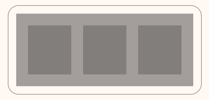
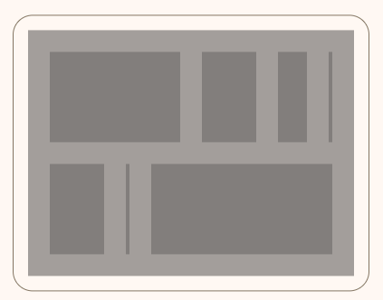
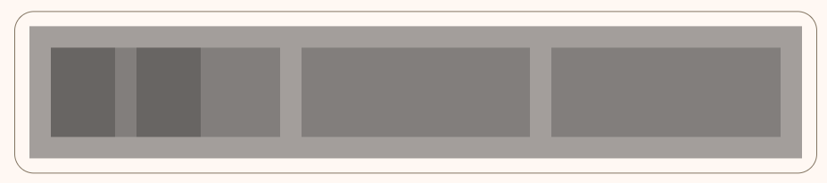
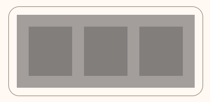
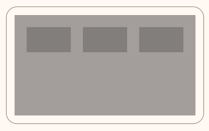

<!-- catalog-only-start --><!-- ---
name: Layout Grid
dirname: layout-grid
-----><!-- catalog-only-end -->

<catalog-component-header>
<catalog-component-header-title slot="title">

# Layout Grid

<!-- no-catalog-start -->

<!--*
# Document freshness: For more information, see go/fresh-source.
freshness: { owner: 'maicol07' reviewed: '2023-10-02' }
tag: 'docType:reference'
*-->

<!-- go/md-button -->

<!-- [TOC] -->

<!-- external-only-start -->
**This documentation is fully rendered on the
[Material Web Additions catalog](https://material-web-additions.maicol07.it/components/layout-grid/).**
<!-- external-only-end -->

<!-- no-catalog-end -->

[Layout grid](https://m2.material.io/design/layout/responsive-layout-grid.html) is Material design’s responsive UI is based on a 12-column grid layout. It has 12 columns on desktop, 8 columns on
tablet and 4 columns on phone.
MD Layout Grid encapsulates [MDC Layout Grid](https://material.io/develop/web/components/layout-grid).

</catalog-component-header-title>


</catalog-component-header>

* [Design article](https://m2.material.io/design/layout/responsive-layout-grid.html#columns-gutters-and-margins) <!-- {.external} -->
* [API Documentation](#api)
* [Source code](https://github.com/maicol07/material-web-additions/tree/main/layout-grid)
  <!-- {.external} -->

<!-- catalog-only-start -->

<!--

## Interactive Demo



-->

<!-- catalog-only-end -->

## Usage
Layout grid is a 12-column system. It has 12 columns on desktop, 8 columns on tablet and 4 columns on phone.
Each element inside `md-layout-grid` will be recognized as a single cell. Default span size for cell is 4 columns.

<!-- no-catalog-start -->



<!-- no-catalog-end -->
<!-- catalog-only-start -->

<!--

<div class="figure-wrapper">
  <figure
      style="justify-content:center;gap: 8px;padding: 16px;"
      title="Outlined and filled cards."
      aria-label="An outlined card with the text 'Content' next to a filled card with the text 'Content'">
<style>
.demo-grid {
  background: var(--md-sys-color-surface-container);
  min-width: 360px;
}
.demo-grid--alignment {
  max-width: 800px;
}
.demo-grid--cell-alignment {
  min-height: 200px;
}
.demo-inner {
  min-height: 200px;
}
.demo-cell {
  background: var(--md-sys-color-surface-dim);
  height: 100px;
}
.demo-grid .demo-grid .demo-cell {
    background: var(--md-sys-color-outline);
    height: 100px;
}
.demo-cell--alignment {
  max-height: 50px;
}
</style>
            <md-layout-grid class="demo-grid">
              <div class="demo-cell"></div>
              <div class="demo-cell"></div>
              <div class="demo-cell"></div>
            </md-layout-grid>
  </figure>
</div>

-->

<!-- catalog-only-end -->

```html
<md-layout-grid class="demo-grid">
  <div class="demo-cell"></div>
  <div class="demo-cell"></div>
  <div class="demo-cell"></div>
</md-layout-grid>
```

### Custom span size
The `grid-span` attribute can be used to specify the number of columns a cell should span.

<!-- no-catalog-start -->



<!-- no-catalog-end -->
<!-- catalog-only-start -->

<!--

<div class="figure-wrapper">
  <figure
      style="justify-content:center;gap: 8px;padding: 16px;"
      title="Outlined and filled cards."
      aria-label="A clickable elevated card with the title 'Our Changing Planet' and the subtitle 'by Kurt Wagner'">
    <md-layout-grid class="demo-grid">
      <div class="demo-cell" grid-span="6"></div>
      <div class="demo-cell" grid-span="3"></div>
      <div class="demo-cell" grid-span="2"></div>
      <div class="demo-cell" grid-span="1"></div>
      <div class="demo-cell" grid-span="3"></div>
      <div class="demo-cell" grid-span="1"></div>
      <div class="demo-cell" grid-span="8"></div>
    </md-layout-grid>
  </figure>
</div>

-->

<!-- catalog-only-end -->

```html
<md-layout-grid class="demo-grid">
  <div class="demo-cell" grid-span="6"></div>
  <div class="demo-cell" grid-span="3"></div>
  <div class="demo-cell" grid-span="2"></div>
  <div class="demo-cell" grid-span="1"></div>
  <div class="demo-cell" grid-span="3"></div>
  <div class="demo-cell" grid-span="1"></div>
  <div class="demo-cell" grid-span="8"></div>
</md-layout-grid>
```

### Nested
When your contents need extra structure that cannot be supported by single layout grid, you can nest layout grid within each other. To nest layout grid, add a new `md-layout-grid` with attribute `inner` to wrap around nested content.
The nested layout grid behaves exactly like when they are not nested, e.g, they have 12 columns on desktop, 8 columns on tablet and 4 columns on phone. They also use the **same gutter size** as their parents, but margins are not re-introduced since they are living within another cell.
However, the Material Design guidelines do not recommend having a deeply nested grid as it might mean an over complicated UX.

<!-- no-catalog-start -->



<!-- no-catalog-end -->
<!-- catalog-only-start -->

<!--

<div class="figure-wrapper">
  <figure
      style="justify-content:center;gap: 8px;padding: 16px;"
      title="Outlined and filled cards."
      aria-label="A clickable elevated card with the title 'Our Changing Planet', the subtitle 'by Kurt Wagner', a description and a placeholder image">
    <md-layout-grid class="demo-grid">
      <md-layout-grid-inner class="demo-cell demo-grid" style="min-width: 0">
        <div class="demo-cell"></div>
        <div class="demo-cell"></div>
      </md-layout-grid-inner>
      <div class="demo-cell"></div>
      <div class="demo-cell"></div>
    </md-layout-grid>
  </figure>
</div>

-->

<!-- catalog-only-end -->

```html
<md-layout-grid class="demo-grid">
  <md-layout-grid-inner class="demo-cell demo-grid" style="min-width: 0">
    <div class="demo-cell"></div>
    <div class="demo-cell"></div>
  </md-layout-grid-inner>
  <div class="demo-cell"></div>
  <div class="demo-cell"></div>
</md-layout-grid>
```

### Grid alignment
Align the grid to left or right (in this example left). This requires a max-width on the top-level grid element.

<!-- no-catalog-start -->



<!-- no-catalog-end -->
<!-- catalog-only-start -->

<!--

<div class="figure-wrapper">
  <figure
      style="justify-content:center;gap: 8px;padding: 16px;"
      title="Card with buttons"
      aria-label="A clickable elevated card with a text and a subtitle and two buttons">
      <md-layout-grid class="demo-grid demo-grid--alignment" align="left">
        <div class="demo-cell"></div>
        <div class="demo-cell"></div>
        <div class="demo-cell"></div>
      </md-layout-grid>
  </figure>
</div>

-->

<!-- catalog-only-end -->

```html
<md-layout-grid class="demo-grid demo-grid--alignment" align="left">
  <div class="demo-cell"></div>
  <div class="demo-cell"></div>
  <div class="demo-cell"></div>
</md-layout-grid>
```
#### Grid cells alignment
Align the cells grid to top, middle or bottom. This requires a max-width on the top-level grid element.

<!-- no-catalog-start -->



<!-- no-catalog-end -->
<!-- catalog-only-start -->

<!--

<div class="figure-wrapper">
  <figure
      style="justify-content:center;gap: 8px;padding: 16px;"
      title="Card with icon buttons"
      aria-label="A clickable elevated card with a and a subtitle and three icon buttons">
      <md-layout-grid class="demo-grid demo-grid--cell-alignment">
      <div class="demo-cell demo-cell--alignment" grid-align="top"></div>
      <div class="demo-cell demo-cell--alignment" grid-align="middle"></div>
      <div class="demo-cell demo-cell--alignment" grid-align="bottom"></div>
    </md-layout-grid>
  </figure>
</div>

-->

<!-- catalog-only-end -->

```html
<md-layout-grid class="demo-grid demo-grid--cell-alignment">
  <div class="demo-cell demo-cell--alignment" grid-align="top"></div>
  <div class="demo-cell demo-cell--alignment" grid-align="middle"></div>
  <div class="demo-cell demo-cell--alignment" grid-align="bottom"></div>
</md-layout-grid>
```

## Theming
| Token                                    | Description                                                                            | Default value |
|------------------------------------------|----------------------------------------------------------------------------------------|---------------|
| `--mdc-layout-grid-margin-desktop`       | Space between the edge of the grid and the edge of the first cell for desktop devices. | `24px`        |
| `--mdc-layout-grid-gutter-desktop`       | Space between edges of adjacent cells for desktop devices.                             | `24px`        |
| `--mdc-layout-grid-column-width-desktop` | Space between the edge of the grid and the edge of the first cell for desktop devices. | `72px`        |
| `--mdc-layout-grid-margin-tablet`        | Space between the edge of the grid and the edge of the first cell for tablet devices.  | `16px`        |
| `--mdc-layout-grid-gutter-tablet`        | Space between edges of adjacent cells for tablet devices.                              | `16px`        |
| `--mdc-layout-grid-column-width-tablet`  | Space between the edge of the grid and the edge of the first cell for tablet devices.  | `72px`        |
| `--mdc-layout-grid-margin-phone`         | Space between the edge of the grid and the edge of the first cell for phone devices.   | `16px`        |
| `--mdc-layout-grid-gutter-phone`         | Space between edges of adjacent cells for phone devices.                               | `16px`        |
| `--mdc-layout-grid-column-width-phone`   | Space between the edge of the grid and the edge of the first cell for phone devices.   | `72px`        |

<!-- auto-generated API docs start -->

## API


### MdLayoutGrid <code>&lt;md-layout-grid&gt;</code>

#### Properties

<!-- mdformat off(autogenerated might break rendering in catalog) -->

Property | Attribute | Type | Default | Description
--- | --- | --- | --- | ---
`fixedColumnWidth` | `fixed-column-width` | `boolean` | `false` | You can designate each column to have a certain width. The column width can be specified through the CSS custom property `--mdc-layout-grid-column-width-{screen_size}`. The column width is set to 72px on all devices by default.
`align` | `align` | `string` | `'center'` | The grid is by default center aligned. You can set this attribute to `left` or `right` to change this behavior. Note, these modifiers will have no effect when the grid already fills its container.

<!-- mdformat on(autogenerated might break rendering in catalog) -->

<!-- auto-generated API docs end -->
