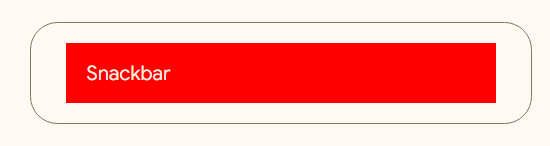

<!-- catalog-only-start --><!-- ---
name: Snackbar
dirname: snackbar
-----><!-- catalog-only-end -->

<catalog-component-header>
<catalog-component-header-title slot="title">

# Snackbar

<!-- no-catalog-start -->

<!--*
# Document freshness: For more information, see go/fresh-source.
freshness: { owner: 'maicol07' reviewed: '2025-03-29' }
tag: 'docType:reference'
*-->

<!-- go/md-button -->

<!-- [TOC] -->

<!-- external-only-start -->
**This documentation is fully rendered on the
[Material Web Additions catalog](https://material-web-additions.maicol07.it/components/snackbar/).**
<!-- external-only-end -->

<!-- no-catalog-end -->

[Snackbars](https://m3.material.io/components/snackbar) show short updates about app processes at the bottom of the screen

</catalog-component-header-title>


</catalog-component-header>

* [Design article](https://m3.material.io/components/snackbar) <!-- {.external} -->
* [API Documentation](#api)
* [Source code](https://github.com/maicol07/material-web-additions/tree/main/snackbar)
  <!-- {.external} -->

<!-- catalog-only-start -->

<!--

## Interactive Demo



-->

<!-- catalog-only-end -->

## Types

<!-- no-catalog-start -->


<!-- no-catalog-end -->
<!-- catalog-only-start -->

<!--

<div class="figure-wrapper">
  <figure
      class="types-image"
      style="justify-content:center;"
      title="Elevated, filled and outlined cards"
      aria-label="The 3 types of cards">
    <style>
      .types-image .wrapper,
      .types-image .wrapper > * {
        display: flex;
        padding: 8px;
        flex-wrap: wrap;
        justify-content: center;
      }
      .types-image .wrapper > * {
        flex-direction: column;
        align-items: center;
        padding-inline: 16px;
      }
      .types-image span {
        display: inline-flex;
        background-color: var(--md-sys-color-inverse-surface);
        color: var(--md-sys-color-inverse-on-surface);
        padding: 8px;
        margin-block-start: 8px;
        width: 24px;
        height: 24px;
        border-radius: 50%;
        justify-content: center;
        align-items: center;
      }
    </style>
    <div class="wrapper">
      <div>
        <md-snackbar open timeout="0">Single-line snackbar</md-snackbar>
        <span>1</span>
      </div>
      <div>
        <md-snackbar open timeout="0" action-text="Action">Single-line snackbar with action</md-snackbar>
        <span>2</span>
      </div>
      <div>
        <md-snackbar open timeout="0" two-lines>
          Two-line snackbar <br>
          without action
        </md-snackbar>
        <span>3</span>
      </div>
        <div>
            <md-snackbar open timeout="0" two-lines action-text="Action">
              Two-line snackbar <br>
              with action
            </md-snackbar>
            <span>4</span>
        </div>
      <div>
        <md-snackbar open timeout="0" two-lines longer-action action-text="Longer action">
          Two-line snackbar <br>
          with longer action
        </md-snackbar>
        <span>5</span>
      </div>
      <div>
        <md-text-button onclick="this.nextElementSibling.open = true">Open</md-text-button>
        <md-snackbar open timeout="0">
          Single-line snackbar with icon button
            <md-icon-button slot="icon">
                <md-icon>close</md-icon>
            </md-icon-button>
        </md-snackbar>
        <span>6</span>
      </div>
      <div>
        <md-text-button onclick="this.nextElementSibling.open = true">Open</md-text-button>
        <md-snackbar fixed>
          Single-line snackbar fixed
        </md-snackbar>
        <span>7</span>
      </div>
    </div>
  </figure>
</div>

-->

<!-- catalog-only-end -->

1. [Single line](#single-line)
2. [Single line with action](#single-line-with-action)
3. [Two lines](#two-lines)
4. [Two lines with action](#two-lines-with-action)
5. [Two lines with longer action](#two-lines-with-longer-action)
6. [Single line with icon button closable/openable](#single-line-with-icon-button)
6. [Single line fixed](#single-line-fixed)

## Usage
Snackbars inform users of a process that an app has performed or will perform.

```html
<md-snackbar open timeout="0">
  Single-line snackbar
</md-snackbar>
```

### Action
A snackbar can contain an action button.

```html
<md-snackbar open timeout="0" action-text="Action">
  Single-line snackbar with action
</md-snackbar>
```

### Two lines
A snackbar can contain two lines of text.

```html
<md-snackbar open timeout="0" two-lines>
  Two-line snackbar <br>
  without action
</md-snackbar>
```

### Icon Button
A snackbar can contain an optional icon button.

```html
<md-snackbar open timeout="0">
  Single-line snackbar with icon button
  <md-icon-button slot="icon">
    <md-icon>close</md-icon>
  </md-icon-button>
</md-snackbar>
```

## Theming

Cards supports [Material theming](https://material-web.dev/theming/material-theming/) and can be customized
in terms of color, typography, and shape.

### Tokens
| Token                           | Default value                       |
|---------------------------------|-------------------------------------|
| `--md-snackbar-container-color` | `--md-sys-color-surface`            |
| `--md-snackbar-container-shape` | `--md-sys-shape-corner-extra-small` |

* [All tokens](https://github.com/maicol07/material-web-additions/blob/main/tokens/_md-comp-snackbar.scss)
  <!-- {.external} -->

### Example

<!-- no-catalog-start -->



<!-- no-catalog-end -->
<!-- catalog-only-start -->

<!--

<div class="figure-wrapper">
  <figure
      style="justify-content:center;align-items:center;"
      class="styled-example"
      title="Snackbar theming example."
      aria-label="Image of a snackbar with a different theme applied">
    <style>
      .styled-example {
        --md-snackbar-container-shape: 0px;
        --md-snackbar-container-color: red;
      }
    </style>

    <md-snackbar open timeout="0" class="styled-example">
      Snackbar
    </md-snackbar>
  </figure>
</div>

-->

<!-- catalog-only-end -->

```html
<style>
  .styled-example {
    --md-snackbar-container-shape: 0px;
    --md-snackbar-container-color: red;
  }
</style>

<md-snackbar open timeout="0" class="styled-example">
  Snackbar
</md-snackbar>
```

<!-- auto-generated API docs start -->

## API


### MdSnackbar <code>&lt;md-snackbar&gt;</code>

#### Properties

<!-- mdformat off(autogenerated might break rendering in catalog) -->

Property | Attribute | Type | Default | Description
--- | --- | --- | --- | ---
`open` | `open` | `boolean` | `false` | Opened state of the snackbar.
`twoLines` | `two-lines` | `boolean` | `false` | Support two lines of text.
`actionText` | `action-text` | `string` | `undefined` | Text for the action button.
`fixed` | `fixed` | `boolean` | `false` | Fixed position of the snackbar.
`timeout` | `timeout` | `number` | `5000` | Timeout for the snackbar to close automatically.

<!-- mdformat on(autogenerated might break rendering in catalog) -->

#### Methods

<!-- mdformat off(autogenerated might break rendering in catalog) -->

Method | Parameters | Returns | Description
--- | --- | --- | ---
`close` | _None_ | `void` | Closes the snackbar.<br>This method will remove the 'opened' class from the snackbar and dispatch a 'close' event. After a timeout, it will set the `open` property to false and dispatch a 'closed' event.
`show` | _None_ | `void` | Opens the snackbar.

<!-- mdformat on(autogenerated might break rendering in catalog) -->

<!-- auto-generated API docs end -->
