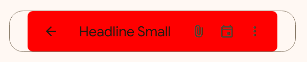

<!-- catalog-only-start --><!-- ---
name: Top App Bar
dirname: top-app-bar
-----><!-- catalog-only-end -->

<catalog-component-header>
<catalog-component-header-title slot="title">

# Top App Bar

<!-- no-catalog-start -->

<!--*
# Document freshness: For more information, see go/fresh-source.
freshness: { owner: 'maicol07' reviewed: '2025-04-27' }
tag: 'docType:reference'
*-->

<!-- go/md-button -->

<!-- [TOC] -->

<!-- external-only-start -->
**This documentation is fully rendered on the
[Material Web Additions catalog](https://material-web-additions.maicol07.it/components/top-app-bar/).**
<!-- external-only-end -->

<!-- no-catalog-end -->

[Top app bars](https://m3.material.io/components/top-app-bar) display navigation, actions, and text at the top of a screen.

</catalog-component-header-title>


</catalog-component-header>

* [Design article](https://m3.material.io/components/top-app-bar) <!-- {.external} -->
* [API Documentation](#api)
* [Source code](https://github.com/maicol07/material-web-additions/tree/main/top-app-bar)
  <!-- {.external} -->

<!-- catalog-only-start -->

<!--

## Interactive Demo



-->

<!-- catalog-only-end -->

## Types

<!-- no-catalog-start -->


<!-- no-catalog-end -->
<!-- catalog-only-start -->

<!--

<div class="figure-wrapper">
  <figure
      class="types-image"
      style="justify-content:center;"
      title="Center-aligned, small, medium and large top app bar types."
      aria-label="The 4 types of top app bars">
    <style>
      .types-image .wrapper,
      .types-image .wrapper > * {
        display: flex;
        padding: 8px;
        flex-wrap: wrap;
        justify-content: center;
      }
      .types-image .wrapper > * {
        flex-direction: row;
        align-items: center;
        padding-inline: 16px;
      }
      .types-image span {
        display: inline-flex;
        background-color: var(--md-sys-color-inverse-surface);
        color: var(--md-sys-color-inverse-on-surface);
        padding: 8px;
        margin-block-start: 8px;
        width: 24px;
        height: 24px;
        border-radius: 50%;
        justify-content: center;
        align-items: center;
      }
    </style>
    <div class="wrapper">
      <div>
        <md-center-aligned-top-app-bar>
<md-icon-button slot="start"><md-icon>menu</md-icon></md-icon-button>
          <div>Title Large</div>
<md-icon-button slot="end"><md-icon>account_circle</md-icon></md-icon-button>
        </md-center-aligned-top-app-bar>
        <span>1</span>
      </div>
      <div>
        <md-small-top-app-bar>
<md-icon-button slot="start"><md-icon>arrow_back</md-icon></md-icon-button>
          <div>Title Large</div>
<div slot="end">
  <md-icon-button><md-icon>attach_file</md-icon></md-icon-button>
  <md-icon-button><md-icon>event</md-icon></md-icon-button>
  <md-icon-button><md-icon>more_vert</md-icon></md-icon-button>
</div>
        </md-small-top-app-bar>
        <span>2</span>
      </div>
      <div>
        <md-medium-top-app-bar>
<md-icon-button slot="start"><md-icon>arrow_back</md-icon></md-icon-button>
          <div>Headline Small</div>
<div slot="end">
  <md-icon-button><md-icon>attach_file</md-icon></md-icon-button>
  <md-icon-button><md-icon>event</md-icon></md-icon-button>
  <md-icon-button><md-icon>more_vert</md-icon></md-icon-button>
</div>
</md-medium-top-app-bar>
        <span>3</span>
      </div>
      <div>
        <md-large-top-app-bar>
<md-icon-button slot="start"><md-icon>arrow_back</md-icon></md-icon-button>
          <div>Headline Small</div><div slot="end">
    <md-icon-button><md-icon>attach_file</md-icon></md-icon-button>
    <md-icon-button><md-icon>event</md-icon></md-icon-button>
    <md-icon-button><md-icon>more_vert</md-icon></md-icon-button>
  </div>
</md-large-top-app-bar>
          <span>4</span>
      </div>
    </div>
  </figure>
</div>

-->

<!-- catalog-only-end -->

1. [Center-aligned](#center-aligned)
2. [Small](#small)
3. [Medium](#medium)
4. [Large](#large)

## Usage

### Center-aligned
A center-aligned top app bar is a top app bar with the title centered.

```html
<md-center-aligned-top-app-bar>
  <md-icon-button slot="start">
    <md-icon>menu</md-icon>
  </md-icon-button>
  <div>Title Large</div>
  <md-icon-button slot="end">
    <md-icon>account_circle</md-icon>
  </md-icon-button>
</md-center-aligned-top-app-bar>
```

### Small
A small top app bar is a top app bar with a title and up to 3 trailing icons.

```html
<md-small-top-app-bar>
  <md-icon-button slot="start">
    <md-icon>arrow_back</md-icon>
  </md-icon-button>
  <div>Title Large</div>
  <div slot="end">
    <md-icon-button>
      <md-icon>attach_file</md-icon>
    </md-icon-button>
    <md-icon-button>
      <md-icon>event</md-icon>
    </md-icon-button>
    <md-icon-button>
      <md-icon>more_vert</md-icon>
    </md-icon-button>
  </div>
</md-small-top-app-bar>
```

### Medium
A medium top app bar is a top app bar with a title and up to 3 trailing icons.

```html
<md-medium-top-app-bar>
  <md-icon-button slot="start">
    <md-icon>arrow_back</md-icon>
  </md-icon-button>
  <div>Headline Small</div>
  <div slot="end">
    <md-icon-button>
      <md-icon>attach_file</md-icon>
    </md-icon-button>
    <md-icon-button>
      <md-icon>event</md-icon>
    </md-icon-button>
    <md-icon-button>
      <md-icon>more_vert</md-icon>
    </md-icon-button>
  </div>
</md-medium-top-app-bar>
```

### Large
A large top app bar is a top app bar with an headline and up to 3 trailing icons.

```html
<md-medium-top-app-bar>
  <md-icon-button slot="start">
    <md-icon>arrow_back</md-icon>
  </md-icon-button>
  <div>Headline Small</div>
  <div slot="end">
    <md-icon-button>
      <md-icon>attach_file</md-icon>
    </md-icon-button>
    <md-icon-button>
      <md-icon>event</md-icon>
    </md-icon-button>
    <md-icon-button>
      <md-icon>more_vert</md-icon>
    </md-icon-button>
  </div>
</md-medium-top-app-bar>
```

## Theming

Top app bars supports [Material theming](https://material-web.dev/theming/material-theming/) and can be customized
in terms of color, typography, and shape.

### Tokens
| Token                                    | Default value                |
|------------------------------------------|------------------------------|
| `--md-$type-top-app-bar-container-color` | `--md-sys-color-surface`     |
| `--md-$type-top-app-bar-container-shape` | `--md-sys-shape-corner-none` |

* [All tokens](https://github.com/maicol07/material-web-additions/blob/main/tokens/_md-comp-top-app-bar-small.scss)
  <!-- {.external} -->

### Example

<!-- no-catalog-start -->



<!-- no-catalog-end -->
<!-- catalog-only-start -->

<!--

<div class="figure-wrapper">
  <figure
      style="justify-content:center;align-items:center;"
      class="styled-example"
      title="Top app bar theming example."
      aria-label="A small top app bar with a different theme applied">
    <style>
      .styled-example {
        --md-small-top-app-bar-container-shape: 8px;
        --md-small-top-app-bar-container-color: red;
      }
    </style>
    <md-small-top-app-bar>
      <md-icon-button slot="start">
        <md-icon>arrow_back</md-icon>
      </md-icon-button>
      <div>Headline Small</div>
      <div slot="end">
        <md-icon-button>
          <md-icon>attach_file</md-icon>
        </md-icon-button>
        <md-icon-button>
          <md-icon>event</md-icon>
        </md-icon-button>
        <md-icon-button>
          <md-icon>more_vert</md-icon>
        </md-icon-button>
      </div>
    </md-small-top-app-bar>
  </figure>
</div>

-->

<!-- catalog-only-end -->

```html
<style>
  .styled-example {
    --md-small-top-app-bar-container-shape: 8px;
    --md-small-top-app-bar-container-color: red;
  }
</style>

<md-small-top-app-bar class="styled-example">
  <md-icon-button slot="start">
    <md-icon>arrow_back</md-icon>
  </md-icon-button>
  <div>Headline Small</div>
  <div slot="end">
    <md-icon-button>
      <md-icon>attach_file</md-icon>
    </md-icon-button>
    <md-icon-button>
      <md-icon>event</md-icon>
    </md-icon-button>
    <md-icon-button>
      <md-icon>more_vert</md-icon>
    </md-icon-button>
  </div>
</md-small-top-app-bar>
```

<!-- auto-generated API docs start -->

## API


### MdCenterAlignedTopAppBar <code>&lt;md-center-aligned-top-app-bar&gt;</code>

#### Properties

<!-- mdformat off(autogenerated might break rendering in catalog) -->

Property | Attribute | Type | Default | Description
--- | --- | --- | --- | ---
`sticky` | `sticky` | `boolean` | `false` | Whether the top app bar is sticky.

<!-- mdformat on(autogenerated might break rendering in catalog) -->

### MdLargeTopAppBar <code>&lt;md-large-top-app-bar&gt;</code>

#### Properties

<!-- mdformat off(autogenerated might break rendering in catalog) -->

Property | Attribute | Type | Default | Description
--- | --- | --- | --- | ---
`sticky` | `sticky` | `boolean` | `false` | Whether the top app bar is sticky.

<!-- mdformat on(autogenerated might break rendering in catalog) -->

### MdMediumTopAppBar <code>&lt;md-medium-top-app-bar&gt;</code>

#### Properties

<!-- mdformat off(autogenerated might break rendering in catalog) -->

Property | Attribute | Type | Default | Description
--- | --- | --- | --- | ---
`sticky` | `sticky` | `boolean` | `false` | Whether the top app bar is sticky.

<!-- mdformat on(autogenerated might break rendering in catalog) -->

### MdSmallTopAppBar <code>&lt;md-small-top-app-bar&gt;</code>

#### Properties

<!-- mdformat off(autogenerated might break rendering in catalog) -->

Property | Attribute | Type | Default | Description
--- | --- | --- | --- | ---
`sticky` | `sticky` | `boolean` | `false` | Whether the top app bar is sticky.

<!-- mdformat on(autogenerated might break rendering in catalog) -->

<!-- auto-generated API docs end -->
